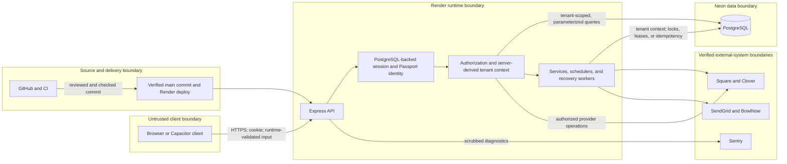

# LeagueVault Security

This document is the repository-level authority for LeagueVault's security
model, contributor responsibilities, and vulnerability-reporting process. It
is written for maintainers, developers, reviewers, operators, future
contributors, and responsible security researchers.

Implementation details remain authoritative in the code and tests. Use this
document to understand the boundaries that the implementation must preserve.
For system structure, local development, release operations, and database
ownership details, see [Architecture](docs/ARCHITECTURE.md),
[Development](docs/DEVELOPMENT.md), [Deployment](docs/DEPLOYMENT.md),
[Database](docs/DATABASE.md), the
[production runbook](docs/production-runbook.md), and the [README](README.md).

## 1. Security scope and philosophy

This document covers the production application, its browser and Capacitor
clients, the Express API, authentication and authorization, PostgreSQL data,
external providers, deployment and CI trust boundaries, secret handling,
secure development, vulnerability reporting, and incident-response
expectations.

It is not an API reference, database catalog, deployment checklist, provider
contract, penetration-test report, compliance certification, or guarantee of
security. Follow the linked operational documents for exact deployment and
database procedures. Do not put credentials, customer data, exploit payloads,
or sensitive incident details in this public document.

LeagueVault follows these principles:

- deny by default;
- authenticate before trusting an identity;
- authorize every protected action and resource;
- derive and enforce tenant boundaries on the server;
- grant the minimum privilege needed;
- keep secrets out of source control, logs, telemetry, prompts, and client
  bundles;
- validate all input at runtime, including input from external providers;
- fail closed when identity, ownership, provider authenticity, or security
  state is ambiguous;
- preserve auditability for sensitive administrative and financial actions;
  and
- never treat client-side routing, hidden controls, or client state as a
  security boundary.

Payment, tenant, identity, and customer-data boundaries receive heightened
scrutiny because mistakes can expose another organization, impersonate a user,
or cause a financial side effect. Passing tests or scanners is necessary but
does not independently prove that the application is secure.

## 2. Security architecture overview

The browser and native clients are untrusted. They may suggest a subdomain,
organization, resource identifier, payment source, or action, but Express must
validate the request and prove identity, permission, and ownership. Express is
the policy-enforcement point. PostgreSQL is the application system of record.
External providers are separate trust domains whose callbacks and responses
must be authenticated or validated. Render, Neon, GitHub, and CI own platform
controls and runtime secret delivery, but they do not replace LeagueVault's
request-level authorization.

Trusted server-side decisions include session validity, role checks, tenant
resolution, resource ownership, payment amounts, refund authority, and
provider selection. Untrusted inputs include every path parameter, query
string, header, cookie, request body, uploaded file, provider response, and
webhook body until the applicable checks succeed. Infrastructure systems own
only their documented controls, identities, and secret stores.

## 3. Authentication model

LeagueVault uses local email-and-password authentication through Passport's
local strategy. It does not currently use an external identity provider.

Authentication is divided as follows:

| Layer | Responsibility |
| --- | --- |
| Browser/client | Sends credentials over HTTPS, stores only the server-issued cookie, fetches a CSRF token, and includes that token on protected mutations. Client protected routes are UX only. |
| Express | Validates registration and password input, verifies credentials, establishes and destroys sessions, checks CSRF, applies rate limits, and loads the authenticated user. |
| PostgreSQL | Stores `scrypt` password hashes, server-side session rows, invitation/reset state, organization membership, lockout state, and shared production rate-limit buckets. |
| SendGrid | Delivers invitation, recovery, password-change, and other account notifications. An email message or link is not trusted after its server-side token expires or is consumed. |

A Capacitor application is an untrusted API client. Packaging, application
signing, device identity, and store distribution do not replace server-side
authentication, authorization, CSRF or equivalent request protection, tenant
resolution, and input validation. The current Capacitor shell uses the same
HTTPS origin and session-cookie model as the browser, so its state-changing
requests use the same session-bound CSRF protection rather than a separate
native authentication scheme.

### Passwords and sessions

- Passwords are hashed using Node.js `scrypt` with a fresh random 16-byte salt.
  The stored format is `<hash-hex>.<salt-hex>` and the derived key is 64 bytes.
  This is not a versioned password-hash format: the algorithm and work-factor
  parameters are implicit in the application code rather than encoded with
  each hash. Any algorithm or parameter upgrade therefore requires an
  explicit backward-compatible verification and migration plan. Plaintext
  passwords must never be stored or logged.
- Login uses a dummy password hash for unknown accounts to reduce account
  enumeration through gross timing differences.
- `express-session` stores session state in PostgreSQL through
  `connect-pg-simple`; Passport serializes the user id and reloads the user on
  subsequent requests.
- The production cookie is `Secure`, `HttpOnly`, `SameSite=Lax`, scoped to the
  configured application domain, and issued with an expiry 24 hours in the
  future. `rolling` is not configured, so Express uses its `false` default:
  an ordinary request that does not modify session state does not receive a
  renewed cookie. The browser expiry is therefore 24 hours after the most
  recent cookie issuance, normally login or Passport session regeneration,
  but a response that modifies and resaves session state can reissue the
  cookie with a new 24-hour expiry. This is not a continuously rolling idle
  timeout. A narrow non-production-only test escape hatch permits insecure
  loopback cookies.
- The PostgreSQL session row initially receives the cookie's expiry. On a
  completed request carrying a stored session, Express resets the in-memory
  session expiry and `connect-pg-simple` saves or touches the row, normally
  advancing its `expire` timestamp to about 24 hours after that request even
  when no new cookie is sent. The server row can therefore outlive the browser
  cookie.
  Store lookup rejects an expired row immediately; asynchronous pruning only
  removes already-invalid rows and does not extend their validity.
- There is no remember-me option or alternate server-side lifetime for the
  Capacitor clients. The native shell loads the same HTTPS origin and uses the
  same session cookie. Cookie persistence across native application restarts
  is left to the platform WebView; LeagueVault does not add a native token or
  override the server expiry.
- Logout removes the Passport identity from the current session and Passport
  regenerates that session. Session invalidation during password changes is
  implemented by a parameterized delete against `connect-pg-simple`'s
  PostgreSQL `session` table, matching Passport's serialized user id.
- An administrator-driven reset commits the new password,
  `mustChangePassword=true`, and audit row first. It then invalidates pending
  email-change requests and attempts to delete every session row for the
  target user; no session id is preserved. The deletion is best-effort and is
  not part of the password/audit transaction, so a session-store failure is
  logged but does not roll back the reset.
- A successful self-service password change writes the new password first,
  invalidates pending email-change requests, and then attempts to delete every
  session row for that user except the caller's `req.sessionID`. The current
  session is preserved without regeneration. The deletion is best-effort; if
  it fails, the password remains changed and other sessions may remain valid.
- The invitation/recovery `set-password` flow writes the new password and
  clears recovery state before it attempts to delete every existing session
  row for the user. It then calls Passport's `req.login()`. With the installed
  Passport 0.7 session manager, login regenerates the request session, obtains
  a new session id, serializes the user id, and saves the new session before
  the success callback. If the deletion fails, pre-existing sessions may
  remain; if login fails, the password change still succeeds but the response
  tells the user to log in manually.
- Row deletion invalidates sessions present in PostgreSQL when the delete
  executes. It does not cancel a request that already loaded an authenticated
  session, and it is not a per-request password-version check. Code must not
  describe this best-effort mechanism as an instantaneous, transactional
  revocation guarantee.

### Registration, recovery, and invitations

Self-registration requires a server-resolved organization subdomain, a
matching organization id, and an active league that permits public signup.
Invitation and password-recovery flows use random, expiring, single-use token
state stored with the user. Token comparisons use a constant-time helper.
Password setup/reset clears the token, rotates the password, invalidates
pending email-change requests, attempts best-effort removal of existing
sessions, and then asks Passport to establish a regenerated session. Automatic
login is conditional on that final Passport operation succeeding; it is not
part of the password update. Forgot-password responses avoid confirming
whether an account exists.

API tests exercise preservation of the caller during self-service change and
removal of pre-reset sessions during `set-password`. The administrator-reset
route has unit coverage for its session-deletion call and separate database
coverage for password/audit atomicity, but it does not currently have the same
end-to-end, real-session invalidation test. Add that focused integration test
before strengthening the administrator-reset guarantee or refactoring its
ordering.

Administrator-driven password reset forces the user to change the temporary
password before other protected workflows are available. Repeated failures on
the authenticated password-change endpoint can temporarily block further
password-change attempts for that account, destroy all of the account's
sessions, and send a notification. The lock is specific to password changes;
it is not a general account-status or login lock. These protections do not
justify exposing passwords through an administrator workflow or message.

### Request protections

- State-changing browser requests require a session-bound CSRF token. Narrow
  exemptions are permitted only for routes that cannot use browser-session
  CSRF protection and that enforce their own reviewed credential,
  single-use-token, webhook-signature, bootstrap, or constrained-public-input
  boundary. An exemption removes only the CSRF-token requirement; it does not
  grant authentication, authorization, or tenant authority.
- The current exemption categories are not interchangeable:
  - login verifies the submitted credentials and is rate-limited;
    registration validates a server-resolved organization context and public
    signup policy and is rate-limited; forgot-password is rate-limited and
    returns an enumeration-resistant response. These pre-authentication
    routes do not claim an existing user's authority merely because they are
    CSRF-exempt;
  - `set-password` and email-change confirmation require an expiring,
    single-use server-side token and apply their route-specific rate limits;
  - setup endpoints require the out-of-band `x-setup-secret`, a configured
    strength floor, rate limiting, and the atomic invariant that no
    administrator already exists;
  - every production request to the Clover webhook endpoint passes the same
    HMAC-SHA256 gate over the exact raw JSON bytes before event-type dispatch,
    lookup, or mutation. The Square webhook path remains an unauthenticated,
    non-processing tripwire: it applies a small route-specific body limit and
    shared production rate limit before returning `501`, does not enter tenant
    resolution or call application storage, and records only bounded metadata
    with a server-generated request id; see the limitation below;
  - account-deletion request submission and embedded league registration are
    intentionally public. They do not authenticate a user. Their handlers
    constrain input with runtime schemas, rate limits, anti-enumeration or
    per-email quotas where applicable, and narrow business rules such as an
    active league explicitly allowing public signup; and
  - health, CSRF-token issuance, and invite validation use `GET` and do not
    perform a protected domain mutation, so the state-changing-method CSRF
    gate would not run for them. The non-production `_test` exemption is not
    mounted in production.
- Authentication, account-management, setup, public registration, payment,
  administrative, invitation, and other abuse-prone paths use rate limits.
  Every current `express-rate-limit` instance supplies the repository's shared
  store factory. With the required production setting `NODE_ENV=production`,
  production persists those namespaces in PostgreSQL and shares each quota
  across application processes. A source-scanning test fails when a new
  `express-rate-limit` instance omits `createSharedRateLimitStore`. Development
  and test intentionally use the library's process-local memory store so test
  runs start with empty buckets; that configuration is not suitable for a
  multi-process deployment.
- Express trusts one proxy hop. A boot assertion, code checks, tests, and a
  deployed probe protect the `req.ip` and secure-cookie assumptions. See the
  [production runbook](docs/production-runbook.md).
- Helmet security headers and route-specific content-security policy are
  installed before application routes.

Setup/bootstrap endpoints are not normal user authentication. They are
disabled without `SETUP_SECRET`, compare the header in constant time, require
a strong configured value, are rate-limited, and only work while no
administrator exists. The trust-proxy probe can use a separate, strongly
validated operator token for its one narrow endpoint. Treat both values as
high-privilege server credentials.

## 4. Authorization boundaries

Authentication answers who the caller is. Authorization determines what that
identity may do to a specific resource in a specific organization.

The supported user roles are:

| Role or grant | Boundary |
| --- | --- |
| `user` | Organization member. Normally limited to the user's linked bowler and explicitly permitted league workflows. |
| `league_secretary` grant | Delegated administration for named leagues only. It is not a platform role and does not grant organization-wide payment-provider or location authority. |
| `org_admin` | Administrative authority within the user's organization. It is not cross-tenant authority. |
| `system_admin` | Explicit platform administration. Cross-tenant actions must still use routes and storage paths designed for that purpose. |

Express mount middleware provides broad authentication and role gates.
Resource helpers in `server/utils/access-control.ts`, route checks, scoped
storage methods, and selected database invariants provide the narrower
resource boundary. Background workers receive authority from stored,
server-owned job or schedule records, not from a browser session.

The shared access helpers do not treat `system_admin` as authority over
org-less rows: they require established, non-null resource organization
context, and ID-based helpers load the ownership chain before deciding. Missing
or null organization ownership is denied for every role. A helper may grant a
system administrator cross-tenant access only after establishing a real owning
organization. Routes that need broader inspection or repair behavior use an
explicit system-administration path rather than weakening the shared helpers.

Server-side authorization is required before reading protected data,
modifying a row, charging or refunding, changing users or organizations,
accessing administrative workflows, or invoking a sensitive provider action.
Payment and refund routes must prove access to the bowler, league, payment,
saved source, and owning location as applicable.

Representative secure patterns already used by the repository include:

- loading a league and checking its organization before permitting an
  organization administrator or league secretary action;
- using `hasAdminAccessToLeague`, `hasAccessToBowler`, or the relevant payment
  authorization helper before reading or mutating a target;
- passing a server-authorized `organizationId` into scoped storage methods;
- returning allowlisted user, organization, location, bowler, and payment
  projections; and
- rejecting org-less tenant rows instead of treating them as global.

Insecure patterns include querying a tenant-owned table by `id` alone,
accepting a request body's `organizationId` as proof, authorizing from a
hidden button, assuming an authenticated route grants access to every row,
or allowing possession of a provider or database identifier to establish
ownership. Those patterns are prohibited even if the current UI cannot
produce the request.

## 5. Tenant isolation

An organization is the tenant root. Tenant hostname resolution currently uses
these exact rules:

- The incoming hostname and configured `APP_DOMAIN` are normalized to
  lowercase. Only one label directly beneath `APP_DOMAIN` is eligible; the
  bare domain, `www`, reserved infrastructure labels, nested labels, IP and
  localhost hosts, recognized Replit development hosts, and hosts under any
  other suffix do not establish an organization context.
- The eligible label is first compared exactly with `organizations.subdomain`.
  Only when that lookup finds no row is the same label compared exactly with
  `organizations.slug`. Organization write schemas require lowercase values.
- Arbitrary per-organization custom domains are not tenant-routing aliases.
  `APP_DOMAIN` configures the platform-wide base domain, while organization
  embed-domain allowlists serve a separate framing policy and do not affect
  organization resolution.
- The `__org_slug` query override takes precedence over the hostname only when
  `NODE_ENV` is not `production` and the value matches the lowercase slug
  syntax. It performs the same subdomain-first, slug-second lookup. It is not
  available when `NODE_ENV=production`.

Slug and subdomain values share one normalized hostname namespace. A database
trigger serializes hostname mutations and rejects any value already owned by
another organization, including cross-field and mixed-case collisions. The
deployment procedure runs a read-only existing-data audit before installing
that invariant. Once an organization is resolved, the organization-host
session guard requires the authenticated user to belong to that organization,
except for the explicit system-administrator boundary and a documented
bootstrap path that stamps an otherwise unassigned linked bowler user.

Users carry an organization membership. A `system_admin` account may exist
without an organization membership where the specific platform workflow
supports that state. Normal users and organization administrators may not. A
runtime database trigger enforces the non-admin user/organization invariant.
League-secretary grants carry organization, user, and league references, with
database invariants protecting their organization consistency and revoking
stale grants when membership changes.

Tenant ownership is direct for some rows and inherited through parents for
others:

- locations and bowlers have required organization stamps;
- leagues have an organization stamp, with null retained only for legacy
  orphan-recovery handling;
- teams, games, scores, and registration questions inherit ownership through
  their league and related rows;
- payments and schedules reference both bowler and league and require those
  relationships to agree;
- registrations, payment links, secretary grants, and tenant audit rows carry
  direct or relational ownership; and
- sessions, rate-limit buckets, email templates, deletion requests, and
  selected operational state are platform-wide rather than tenant roots.

The complete ownership map and approved invariants are in
[Database: Tenant ownership relationships](docs/DATABASE.md#tenant-ownership-relationships).

The mandatory query rule is:

> Every tenant-owned read or write must include a server-derived tenant
> boundary.

Apply the rule to direct queries, parent-child lookups, joins, batch changes,
imports, exports, reports, logs, caches, scheduled jobs, recovery work,
provider identifiers, and future file/object storage. When ownership is
indirect, load or join through the parent and verify all organization stamps.
An identifier from the browser is untrusted until authenticated membership and
server-side ownership reconcile it to the same tenant.

Workers preserve tenant context through the stored bowler, league, location,
schedule, job item, or organization relationships. Payment and sync sweeps use
database locks, leases, or durable state to coordinate across processes.
Clover settled-refund and dispute callbacks map `data.object.charge` exactly
to a local payment's `cloverChargeId`. For those event families, a missing or
unknown charge identifier is acknowledged with `200` without mutation; it
does not grant access or create a new tenant association. Other event types
follow the event-specific behavior documented below rather than a universal
identifier-mapping rule.

Support and administrative access is limited to explicit `system_admin`
routes and purpose-built data-integrity workflows. Organization teardown is a
system-admin-only atomic database operation. It removes app-owned tenant data
and organization audit data, preserves and detaches platform administrators,
and does not delete remote provider customer objects.

PostgreSQL row-level security is **not an active authorization boundary**.
Fresh databases define no RLS policies. Production's reviewed legacy RLS flags
are inert because there are no policies and the application role bypasses
them. Tenant isolation is currently enforced by Express authorization,
application queries, storage contracts, tests, and selected database
invariants.

## 6. Secret handling

Production secrets belong in the system that owns or consumes them: Render,
Neon, Square, Clover, SendGrid, Sentry, GitHub Actions, or another approved
provider secret store. Render injects literal environment-variable values at
runtime; the application does not expect Render secret files. Local-only
secrets belong in a secure local secret manager or the active shell and must
remain excluded from Git.

Secret material includes database credentials, `SESSION_SECRET`,
`FIELD_ENCRYPTION_KEY`, payment-provider credentials, webhook signing secrets,
SendGrid and BowlNow keys, setup/bootstrap credentials, probe or recovery
credentials, provider tokens, and temporary database migration confirmations.
The [Development guide](docs/DEVELOPMENT.md) and
[production runbook](docs/production-runbook.md) document configuration
without publishing values.

Secrets must never appear in source code, committed environment files,
documentation, fixtures, screenshots, issues, pull requests, logs, prompts,
chat transcripts, or database dumps shared outside approved controls. Never
use production credentials locally. Test values must be deterministic fakes
that cannot operate against production.

Only intentionally public configuration may reach a browser. Vite embeds every
`VITE_*` value into browser-delivered code at build time; therefore a value
with that prefix cannot be treated as secret. Browser-visible payment
application/location identifiers and a Sentry DSN are configuration, while
access tokens, webhook secrets, database URLs, session secrets, encryption
keys, and setup tokens remain server-only.

Location-specific Square and Clover access tokens are encrypted before
storage with AES-256-GCM using `FIELD_ENCRYPTION_KEY` and are removed from
normal API projections. The key itself remains server-only. A decryption or
authentication-tag failure must prevent use of the credential and produce a
safely redacted operational error. See the known limitation below for the
separate per-organization BowlNow configuration.

Rotation is an operator-owned, provider-specific process:

1. contain use of the suspected value and identify every consumer;
2. revoke or rotate it at the owning provider;
3. update the approved secret store or encrypted application field;
4. restart or redeploy consumers when required;
5. validate authentication, provider, webhook, or database behavior; and
6. review logs and history without copying the old value into notes.

Changing `SESSION_SECRET` invalidates existing cookies. Rotating
`FIELD_ENCRYPTION_KEY` requires a reviewed re-encryption plan for existing
ciphertext; replacing it without migration makes stored provider credentials
unreadable. Any value that may have been exposed must be rotated immediately,
not merely deleted from the latest commit. Follow the deployment and incident
procedures for history, log, and provider containment.

## 7. Data protection

Sensitive data includes user identities and contact information, password
hashes and reset/invitation state, session data, tenant membership, bowler
profiles, payment metadata, saved-provider references, provider customer and
transaction identifiers, encrypted provider credentials, audit rows, and
operational logs.

- Passwords are one-way hashed. Payment-provider access tokens stored on
  locations are application-encrypted as described above.
- Raw card numbers, security codes, and magnetic-stripe data must remain with
  approved payment providers. LeagueVault stores payment metadata and opaque
  provider customer, card/source, charge, receipt, refund, and dispute
  references; it does not intentionally store raw payment-card data. Do not
  introduce raw card data into application storage, logs, analytics, or
  support tools.
- Session cookies, authorization headers, passwords, reset/invite tokens,
  provider credentials, webhook secrets, complete provider payloads, and raw
  payment responses must not be logged.
- Log only the minimum identifiers needed to diagnose an event. Mask contact
  data and redact credentials, token-shaped values, sensitive URLs, and
  unnecessary personal information. Client telemetry has a central scrubber
  and Sentry `beforeSend` backstop. Server call sites remain responsible for
  selecting safe fields, supported by repository checks and tests.
- Audit records must be written from server-derived actor and tenant context.
  Client-supplied actor names, roles, organization identifiers, or
  descriptions must not be treated as authoritative audit identity,
  particularly for administrative and financial events.
- API responses use allowlisted projections for sensitive rows and sanitized
  payment/provider error contracts. Internal stack traces and database or
  provider details must not be sent to users.
- Production customer data and database dumps must not be copied into local
  development or tests. Use deterministic fake data.

Use established account, organization, audit, and deletion workflows for
retention and removal. Organization teardown preserves only the deliberately
documented platform accounts, remote provider objects, and audit history whose
schema semantics require survival. The repository does not establish a single
universal retention period; operators must not invent one in code without
product, legal, and operational review.

No compliance certification is asserted by this document.

## 8. Input validation and API security

TypeScript types disappear at runtime. Every trust boundary needs runtime
validation appropriate to the value and its use.

- Use the established Zod and shared schemas for bodies and domain values,
  plus strict route-parameter and query parsers for identifiers, ranges,
  dates, pagination, and enums.
- Apply length, count, and amount limits before expensive database or provider
  work. Reject unexpected fields where accepting them could change authority
  or server-owned state.
- The global JSON and URL-encoded request ceiling is 256 KB. The email-template
  route has a reviewed 1 MB exception. The disabled Square webhook tripwire
  has a narrower 12 KB body limit applied before the global parser.
- Bulk spreadsheet import is organization-admin-only, rate-limited, limited to
  5 MB, held in memory, restricted to CSV/XLSX, checked by content/magic bytes,
  and bounded during workbook parsing. Future uploads require equivalent size,
  type, content, storage, and authorization review.
- Use Drizzle or parameterized SQL. Never interpolate untrusted strings into
  SQL, identifiers, clauses, or migration commands.
- Encode or sanitize untrusted data for its output context, including HTML
  email, URLs, CSV, logs, and browser rendering. React's defaults do not make
  arbitrary HTML or URL construction safe.
- Return deliberate status codes and safe public messages. Do not expose
  stack traces, SQL, provider response bodies, secret-shaped identifiers, or
  infrastructure details.
- Apply the established rate limit to new public or expensive endpoints and
  verify proxy-aware keying.
- Verify webhook signatures over the exact raw bytes before trusting payload
  fields. Reject missing, ambiguous, or mismatched proof.
- Use idempotency keys, durable uniqueness, locks, leases, and explicit state
  transitions to prevent replay, duplicate payment/refund effects, and races.

Provider responses and SDK objects are also untrusted. Validate required
identifiers, status, currency/amount semantics, ownership, and error shape
before persisting them or presenting them to a user. A successful provider
response cannot retroactively authorize a request that LeagueVault should
have refused.

## 9. Payment and third-party integration boundaries

Provider configuration may be global, per organization, or per location.
Code must resolve the configured provider and credential from the authorized
league/location relationship rather than from a client claim.

| Integration | Current boundary and required controls |
| --- | --- |
| Square | Charges, customers, saved cards, refunds, catalog, receipts, and Apple Pay use server-selected credentials and provider interfaces. Payment creation uses idempotency and local payment state. No Square webhook subscription is currently supported; see limitations. |
| Clover | Charges, customers/sources, refunds, and disputes use location-specific credentials. Every production Clover webhook request uses the common HMAC-SHA256 raw-body gate; processing, replay behavior, and acknowledgement are event-specific as described below. |
| SendGrid | Receives only the minimum recipient and template data needed for transactional mail. API keys stay server-side; templates and substitutions must be safely escaped for their context. |
| BowlNow | Optional CRM/contact synchronization uses organization context and durable retry state. Keep BowlNow sync state separate from payment state; see the stored-key limitation below. |
| Sentry | Receives diagnostics, not an authorization role. Browser events are scrubbed before send. Server events and metadata must be deliberately minimized and redacted at their call sites. |
| Apple/Google wallet and native platform services | Tokenization and domain/app association are external boundaries. They do not grant payment or tenant authority by themselves. |

The current Clover webhook behavior is deliberately narrow:

- Production rejects an unset signing secret with `503` and a missing or
  mismatched `x-clover-signature` with `401`. Only the explicit
  `NODE_ENV=test` seam may bypass verification, and only when the signing
  secret is unset.
- `refund.created`, `refund.updated`, `refund.succeeded`, and
  `charge.refunded` look up `data.object.charge` in `payments.cloverChargeId`.
  An already-refunded row is acknowledged without another write. Otherwise
  the handler marks the row refunded and stamps the local refund fields; a
  row currently marked disputed is not exempt from that transition.
- `dispute.created`, `charge.dispute.created`, and `chargeback.created` use
  the same charge lookup. An already-disputed row is acknowledged without
  another write, and a dispute arriving after the row is refunded is
  acknowledged without overwriting the refunded state. A missing dispute id
  is also acknowledged without mutation.
- `refund.failed` is acknowledged and logged without even looking up or
  changing a payment. Missing event types, unsupported event types, missing
  charge ids, and unknown charge ids in the supported refund/dispute families
  are likewise acknowledged without mutation.
- This is state-based handling of sequential deliveries, not general webhook
  deduplication or chronological ordering. Clover event ids and event times
  are not persisted or compared, and the read-then-write transitions do not
  atomically exclude concurrent duplicate deliveries. See the limitation
  below.

For payment changes:

- separate sandbox/beta and production credentials and refuse known live
  credentials in beta;
- preserve tenant- and location-specific credential selection;
- calculate or verify amounts on the server;
- authorize the charge, refund, schedule, saved source, and acting user before
  the provider call;
- preserve idempotency keys, uniqueness, state transitions, row locks, worker
  leases, and reconciliation behavior;
- never log card data, source tokens, complete provider payloads, credentials,
  or raw provider responses;
- verify callbacks before mutation and map them to an existing local tenant
  relationship;
- keep retries bounded and retry only operations the provider contract makes
  safe; and
- test partial failures where the provider side effect succeeds but the local
  write or response fails.

Provider success never replaces local authentication, authorization, tenant
checks, or reconciliation. Changes to provider SDK usage, credentials,
amounts, refunds, idempotency, or webhooks require focused tests and review of
the current provider contract.

## 10. Security checks and tooling

The repository's current automated controls include:

| Control | Detects or constrains | Does not prove |
| --- | --- | --- |
| `npm run security:audit:prod` and `security:audit:all` | Published npm dependency advisories at configured severity thresholds. | Absence of unknown vulnerabilities, safe usage, or secure application design. |
| Semgrep | Configured static patterns in changed code and scheduled full-tree scans. | Complete data-flow or business-authorization correctness. |
| Gitleaks and HoundDog | Secret-like material and configured credential patterns in diffs/history. | That an unrecognized or externally leaked credential is safe. |
| TypeScript and ESLint | Type errors, source-policy violations, security plugin findings, ignored promises, and ratcheted escape hatches. | Runtime validation or correct tenant ownership. |
| CSRF coverage guard | State-changing route mounts that appear to escape the global CSRF boundary without justification. | Correctness of every exemption or resistance to every CSRF technique. |
| Organization-isolation coverage guard | ID-bearing GET routes without a cross-organization test or explicit justification. | Coverage of every mutation, indirect relationship, or business rule. |
| Wire-sanitization and log checks | Raw sensitive row types on response paths and known secret/PII logging patterns. | That every dynamic value and third-party SDK output is harmless. |
| Vitest API, unit, and component suites | Authentication, authorization, tenant isolation, provider, redaction, webhook, migration, and negative-path contracts represented by tests. | Security of untested states or the deployed infrastructure. |
| Race suite | Selected bootstrap, retry, locking, and shared-state concurrency contracts. | Freedom from all concurrency defects. |
| Database migration checks | Exact migration bytes, replay, fingerprint, journal, target, RLS-compatibility, and refusal invariants. | Correctness of an unreviewed destructive or data-transforming change. |
| Production build and trust-proxy checks | Buildability and configured proxy assumptions in code and the deployed probe. | End-to-end production security. |

PR CI currently runs dependency audits, type checking, lint and repository
policy guards, the production build, PostgreSQL 16/17 migration checks, the
full test suite, and the separate race suite. Semgrep, Gitleaks, and HoundDog
run as separate PR and scheduled workflows. Exact job layout and branch
protection guidance are in [docs/ci.md](docs/ci.md).

Review every finding in context. A suppression is a security decision: scope
it narrowly, explain why the finding is false or accepted, name the compensating
control, and obtain review. Never disable a check, lower a threshold, broaden
an allowlist, or raise a baseline merely to make CI pass. Automated scanners
are evidence, not proof.

## 11. Security-sensitive development workflow

Authentication, sessions, cookies, authorization, organization membership,
tenant queries, payments, webhooks, cryptography, secrets, uploads, proxy
handling, rate limits, setup endpoints, background jobs, database ownership,
provider configuration, and logging/telemetry are security-sensitive.

A dependency update is security-sensitive when it changes authentication,
cryptography, HTTP parsing, sessions, database access, payments, uploads,
serialization, or build-time client exposure. Review its changelog and
transitive dependency changes rather than relying only on the audit result.

For such a change:

1. Identify every affected trust boundary and attacker-controlled input.
2. Review authentication, session, CSRF, and authorization consequences.
3. Trace tenant ownership from the authenticated user through every parent,
   join, batch, cache, worker, and provider identifier.
4. Validate input and constrain output at runtime; keep errors and logs safe.
5. Preserve payment/provider idempotency, retries, locking, leases, and partial
   failure behavior.
6. Add negative tests: unauthenticated, wrong role, wrong tenant, wrong owner,
   missing parent, malformed input, duplicate/replay, and provider failure as
   applicable.
7. Run focused tests while iterating, then every applicable repository check
   in the sequence required by `AGENTS.md`.
8. Inspect new logs, telemetry, screenshots, and fixtures for credentials and
   personal data.
9. Document new environment variables, rotation, deployment order, migration
   implications, monitoring, rollback, and manual verification.
10. Obtain focused review from someone who challenges the trust assumptions
    before merge.

Do not combine unrelated cleanup with a security-sensitive change. A passing
success-path test is insufficient; the refusal paths are part of the feature.

## 12. Prohibited practices

Contributors and operators must not:

- trust a tenant or resource id from a client without membership and ownership
  validation;
- rely on hidden UI, client routing, or route presence as authorization;
- query tenant-owned data by object id without a server-derived tenant or
  verified parent boundary;
- construct SQL from untrusted strings;
- log credentials, session material, authorization headers, complete payment
  payloads, raw provider responses, or unnecessary personal data;
- commit secrets or use production credentials locally;
- copy production records or dumps into tests or development;
- expose a server-only value through `VITE_*` or browser code;
- disable, bypass, weaken, or baseline away a security check to obtain a
  passing build;
- grant broad administrative access without an explicit, reviewed boundary;
- bypass webhook verification or accept a provider identifier as proof of
  tenant ownership;
- weaken cookie, CSRF, trust-proxy, rate-limit, or password protections without
  focused review and tests;
- invent cryptographic formats or algorithms instead of using reviewed
  platform primitives and established utilities;
- manually edit an applied migration or the migration journal;
- return internal errors, stack traces, SQL, or sensitive provider details to
  users; or
- merge a security-sensitive change without negative tests and the applicable
  checks.

## 13. Vulnerability reporting

Do **not** open a public GitHub issue, discussion, or pull request for an
unpatched vulnerability. Do not paste sensitive details into a public contact
form or social-media message.

> **Private reporting channel last verified:** 2026-07-22

At that verification, this repository was private and its observed GitHub
Security configuration exposed no Private Vulnerability Reporting intake. No
dedicated security email or other formal security intake was published in the
repository or the Tribowl organization's public GitHub profile, and no separate
organizational security-contact process was available to verify. This is a
known process limitation, not permission to disclose publicly.

- Repository collaborators should contact LeagueVault/Tribowl maintainers
  through an existing private, access-controlled organizational channel and
  clearly mark the message as a suspected security vulnerability.
- External researchers should use an existing private relationship with the
  LeagueVault operator, if one exists. Otherwise, use an official published
  LeagueVault/Tribowl contact path only to request a private security channel;
  do not include vulnerability details in that initial message.
- If no private channel can be established immediately, preserve the report
  and evidence and retry contact. Do not publish technical details merely
  because intake is incomplete.

A useful report contains:

- the affected component and observed impact;
- minimal reproduction steps and relevant non-secret configuration;
- a proof of concept limited to what is necessary to show the issue;
- whether a tenant, customer, payment, credential, or production system may
  be affected;
- a suggested remediation, if known; and
- a way to contact the reporter securely.

Reporters must not access data that does not belong to them, modify or destroy
data, interrupt production, create real unauthorized charges or refunds,
exfiltrate secrets, retain unnecessary customer data, or disclose the issue
publicly before remediation coordination.

LeagueVault does not promise a bounty or fixed response deadline through this
document. Maintainers will make a reasonable effort to acknowledge valid
reports promptly and provide status updates as the investigation progresses.
The repository owner should establish a dedicated private intake, then update
this section with the verified channel. Update the verification date only
after rechecking repository visibility and GitHub Security settings, the
published organization contact, and the internally confirmed escalation path.

## 14. Incident response expectations

A suspected cross-tenant disclosure, unauthorized payment action, credential
leak, authentication bypass, or production-data disclosure is high priority.

1. Stop or contain the affected operation. Disable or isolate compromised
   functionality when necessary.
2. Preserve relevant evidence, timestamps, release identifiers, audit rows,
   and provider references. Do not contaminate evidence by rerunning unsafe
   actions.
3. Keep credentials and customer data out of investigation notes, tickets,
   screenshots, and chat. Use redacted identifiers and approved secure
   storage.
4. Revoke or rotate every credential that may have been exposed and invalidate
   affected sessions or tokens.
5. Identify the affected tenants, users, data categories, providers, actions,
   and time window.
6. Coordinate database restore/reconciliation and provider recovery where
   required. Preserve payment idempotency and do not create a second financial
   side effect while investigating the first.
7. Fix the root cause, add regression tests, run applicable security and
   release checks, and validate containment before restoring normal operation.
8. Record follow-up actions, monitoring, ownership, and any process or
   architecture changes.
9. Seek legal, privacy, payment, insurance, or specialist guidance when
   notification or preservation obligations may apply.

Do not publish internal contact lists, credentials, or exploitable operational
details in this document. Follow the [production runbook](docs/production-runbook.md)
for deployment, database backup, verification, and recovery controls.

## 15. Security limitations and future work

The following limitations are supported by the current repository or verified
repository configuration:

| Limitation | Current control | Residual risk and condition for change |
| --- | --- | --- |
| Tenant isolation is application-enforced; active PostgreSQL RLS is not configured. | Server authorization, scoped queries/storage methods, tenant tests and coverage guard, foreign keys, and selected runtime database triggers. Production's legacy RLS flags are verified as inert. | A missed application check can cross a tenant boundary. Active RLS requires a coordinated design of policies, roles, privileges, migrations, provider operations, and tests; do not enable flags or policies piecemeal. Track database architecture in [docs/DATABASE.md](docs/DATABASE.md). |
| No verified dedicated private vulnerability-reporting intake exists for this private repository. | Collaborators and known reporters can use existing private organizational channels; public disclosure is prohibited. | An external researcher may be unable to deliver details safely. The repository owner should establish and publish a monitored security email or another verified private intake, then update this file. |
| Square webhooks are not implemented or subscribed, and the disabled endpoint does not verify Square signatures or process events. | The exact `POST` route runs before tenant resolution and global raw-body capture. JSON and catch-all raw parsers enforce the same 12 KB received-body limit for JSON, text, binary, missing content type, and chunked requests. It uses the shared production rate-limit store with a dedicated namespace, generates a server-controlled request id before rate limiting and parsing, and logs one warning for each request admitted by the limiter containing only a fixed event name, the same request id returned to the caller, method, static path, normalized content type, bounded declared content length, and rejection outcome. The declared length is untrusted diagnostic metadata derived from `Content-Length`; invalid, absent, chunked, or excessive values become `null`. Rate-limited requests do not add a route warning. The route never logs headers, query strings, bodies, or raw bytes; returns a deliberate rejection; and makes no application-storage, payment, tenant, queue, reconciliation, or provider call. | A distributed caller can still create bounded warning noise across source addresses, and a real or accidentally configured Square subscription would have every event rejected and unprocessed. Keep the subscription list empty and monitor the dedicated rejection event. Before enabling processing, implement raw-byte signature verification, strict event validation, tenant mapping, durable replay/idempotency protection, safe conditional state transitions, redacted logging, and focused negative tests. |
| Per-organization BowlNow configuration can include an API key in `organizations.integrations` JSON without application-layer field encryption. | Normal organization API projections omit integrations; access is limited by database and server authorization, and a global key may instead be injected server-side. | Database or overly broad server access can expose the stored key. Encrypting it requires a reviewed schema/data migration, backward-compatible read path, rotation plan, and tenant tests before existing rows change. |
| Sentry initialization does not set an explicit release identifier. | Server runtime logs include a commit identifier, CI certifies the exact `main` tree, and browser/server telemetry includes environment context. | Incident correlation between an event and the deployed source may require manual work. Add a release identifier only with coordinated build/runtime injection, privacy review, and deployment verification. |
| Shared rate-limit storage is selected only when `NODE_ENV=production`. | Every current `express-rate-limit` instance is required to use `createSharedRateLimitStore`; a source-scanning test enforces that policy. A production application environment fails during limiter construction unless `NODE_ENV=production` selects the PostgreSQL store. The process-local store remains intentional in development and beta/test environments. | Keep `APP_ENV=prod` and `NODE_ENV=production` explicit and verified in Render. Do not bypass the startup invariant or weaken the shared-store coverage guard. |
| Organization hostname resolution performs a PostgreSQL lookup on every request. | There is no process-local tenant mapping to become stale during a rename or reassignment; every application process observes committed hostname mutations on its next request. Authorization and the organization-host session guard still run against the selected organization. | Tenant-host routing depends on database availability and adds lookup load. Preserve the uncached behavior unless a future shared cache provides tested, fail-safe cross-process invalidation. |
| Clover webhook replay handling is based on the payment row's current status, not a durable event ledger or an atomic conditional transition. | HMAC-SHA256 is verified over the exact raw bytes before dispatch. Sequential repeat refunds and disputes are no-ops once the matching terminal status is present, dispute-after-refund is ignored, and unknown charge ids are acknowledged without mutation. | Event ids and event times are not stored or compared. Concurrent duplicates can both pass the status check and re-stamp a row, and refund-after-dispute changes the status to refunded. Add a durable unique event record and transactional or conditional state transition before claiming general deduplication or ordering guarantees. |

Coverage guards are intentionally scoped static analyses, not exhaustive proof.
Their documented limitations live under [docs/security](docs/security/). A new
gap discovered during review must be tracked and fixed deliberately rather
than hidden by an allowlist.

## 16. Security responsibility summary

- Developers own secure implementation, runtime validation, refusal behavior,
  tests, and safe logs.
- Reviewers own challenging identity, authorization, tenant, payment,
  cryptographic, provider, and operational assumptions and verifying the
  evidence.
- Operators own production configuration, secret stores, credential rotation,
  verified deployments, monitoring, backup/recovery, and incident containment.
- Render, Neon, GitHub, payment providers, email/CRM providers, and Sentry own
  only their stated platform controls. Their controls do not authorize an
  application request.
- LeagueVault must authenticate, authorize, and tenant-scope every protected
  request and preserve the same boundary in workers and external side effects.

When LeagueVault cannot prove that an action is authorized, tenant-safe, and
correctly targeted, it must refuse the action.
