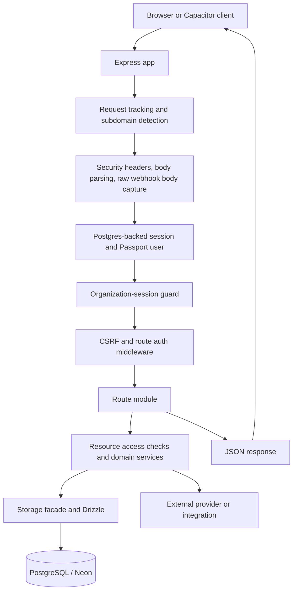
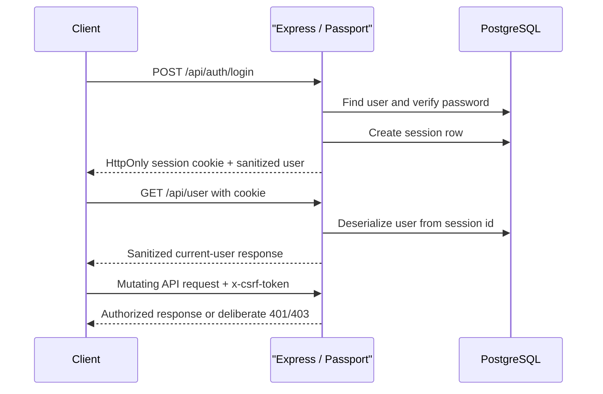

# LeagueVault Architecture

LeagueVault is a multi-tenant adult bowling league management application. A
single TypeScript project builds a React/Vite client and an Express server. The
server serves the browser application and owns the API, authentication,
authorization, persistence, payment-provider calls, webhooks, and background
work.

The durable product and security constraints are summarized in
[`AGENTS.md`](../AGENTS.md). This document describes how the current code is
organized and how the main runtime paths fit together.

## Document Scope

This document describes the verified architecture of the current codebase. It
focuses on system boundaries, dependency direction, security ownership, major
runtime flows, and established extension points.

It is not a complete route inventory, API reference, database catalog, or
deployment runbook. Code and tests remain authoritative for implementation
details. A pull request that changes a boundary or flow described here must
update this document in the same pull request. If an existing discrepancy is
discovered, report it and correct the documentation rather than conforming new
code to stale prose.

## Frontend and Backend Boundaries

### Frontend Responsibilities

The React client under [`client/src/`](../client/src/) is responsible for:

- rendering public, bowler, organization-admin, and system-admin screens;
- client-side routing with Wouter and route-level loading/error states;
- server-state fetching and caching through TanStack Query;
- form state, browser APIs, responsive UI, and Capacitor-specific behavior;
- payment SDK tokenization and payment-form interactions where required by the
  provider; and
- presenting server responses and actionable error messages.

The client sends same-origin requests with credentials. It may use the
organization subdomain to select the current visual context, but it is never
the authority for authentication, tenant isolation, permissions, payment
amounts, refunds, or other business rules.

The main client entrypoints are [`main.tsx`](../client/src/main.tsx), which
initializes Sentry, CSRF-token prefetching, and the React root, and
[`App.tsx`](../client/src/App.tsx), which owns the query provider, lazy route
map, redirect behavior, and client-side protected-route UX.

### Backend Responsibilities

The Express server under [`server/`](../server/) is responsible for:

- parsing and validating requests at the API boundary;
- resolving the organization context from the hostname;
- loading server-side sessions and the authenticated user;
- enforcing authentication, roles, CSRF, rate limits, and resource access;
- applying business rules and coordinating transactions;
- reading and writing PostgreSQL through Drizzle and the storage layer;
- calling Square, Clover, SendGrid, BowlNow, and Sentry integrations;
- receiving and verifying provider webhooks; and
- running scheduled payment, synchronization, audit, and recovery workers.

[`server/app.ts`](../server/app.ts) is the application factory. It is used by
[`server/index.ts`](../server/index.ts) for normal development and production
boot, and by the test harness with background workers suppressed. In
development the app mounts Vite middleware; in production it serves the
prebuilt `dist/public` bundle and provides the SPA fallback.

Most application JSON endpoints use the standard `success`, `data`, and
`error` envelope defined in [`server/utils/api.ts`](../server/utils/api.ts).
Health checks, redirects, webhooks, file responses, and other protocol-specific
endpoints may use deliberate specialized responses. The same utility also owns
deny-by-default wire sanitization for users, organizations, locations, and
other sensitive rows.

## Directory Map

| Path | Responsibility |
| --- | --- |
| [`client/src/`](../client/src/) | React application: pages, shared UI components, hooks, query client, client utilities, and assets. |
| [`client/src/App.tsx`](../client/src/App.tsx) | Client route map, role-aware redirects, lazy loading, and protected-route presentation. |
| [`server/app.ts`](../server/app.ts) | Express app factory, middleware order, health endpoint, static/Vite serving, boot checks, and worker startup. |
| [`server/routes/`](../server/routes/) | HTTP route modules. [`routes/index.ts`](../server/routes/index.ts) mounts the API routers and their broad auth boundaries. |
| [`server/middleware/`](../server/middleware/) | Cross-cutting request behavior: authentication gates, CSRF, subdomain context, security headers, organization context, and embed CSP. |
| [`server/storage/`](../server/storage/) | Database access facade and domain-specific storage modules for leagues, teams, bowlers, payments, users, organizations, and operational records. |
| [`server/services/`](../server/services/) | Business workflows and external-system adapters, including payments, email, BowlNow sync, account lifecycle, schedulers, and recovery workers. |
| [`server/lib/`](../server/lib/) | Server infrastructure helpers such as password handling, shutdown, and trust-proxy verification. |
| [`server/utils/`](../server/utils/) | API, authorization, encryption, date/time, PII, payment-error, input, and operational safety helpers. |
| [`server/migrations/`](../server/migrations/) | Narrow, idempotent application startup or data-backfill routines. This is not a substitute for Drizzle schema changes or the documented production schema-deployment procedure. |
| [`shared/schema/`](../shared/schema/) | Drizzle PostgreSQL tables, relations, Zod insert/update schemas, enums, and shared domain types. [`shared/schema/index.ts`](../shared/schema/index.ts) is the main re-export. |
| [`shared/`](../shared/) | Client/server-safe domain utilities such as schedule, season, financial, password, and environment helpers. |
| [`scripts/`](../scripts/) | Database setup, test infrastructure, coverage checks, security checks, and maintenance scripts. |
| [`tests/`](../tests/) | Unit, API, integration, race, and browser-facing test support and documentation. |
| [`ios/`](../ios/) and [`android/`](../android/) | Intentional Capacitor native application targets. |
| [`docs/`](./) | Operational runbooks, security contracts, testing guidance, and architecture documentation. |

### Server Layering

The normal server dependency direction is:

```text
HTTP request
  -> middleware
  -> route module
  -> access-control / domain service
  -> storage facade
  -> Drizzle + PostgreSQL
```

Lower layers must not import route modules or React code. Shared modules must
remain safe for every runtime that imports them and must not depend on
server-only or browser-only globals unless explicitly separated.

Routes should not trust client-supplied organization or resource identifiers.
They validate input, perform the appropriate access check, and use the storage
methods that preserve organization scope. Simple CRUD routes may call authorized
storage methods directly. Multi-step business workflows, provider operations,
and transaction coordination belong in domain services or explicit
transaction-owning storage operations.

A small number of established routes may currently own transactions directly.
Treat those as visible, tested exceptions rather than precedent for new
route-level transaction ownership. Provider calls belong in `server/services/`,
not in React components or generic route plumbing.

Normal route and service code should use the storage contracts. Direct Drizzle
access outside [`server/storage/`](../server/storage/) is limited to existing,
deliberate infrastructure, invariant, migration/backfill, and
transaction-coordination code. New exceptions require an explicit
architectural justification and focused tests.

Transactions should be owned by the service or storage operation that
coordinates the complete database invariant. Do not begin independent nested
transactions in routes or split an atomic database workflow across unrelated
storage calls.

Database transactions cannot make external provider calls atomic. Workflows
that combine database state and external side effects must use the established
idempotency, durable-state, retry, or reconciliation mechanisms. This is
especially relevant for Square and Clover.

External side effects must be retry-safe where the provider contract permits
it. Payment creation, refunds, webhooks, scheduled jobs, and recovery workers
must use established idempotency keys, durable state, leases, locks, or
reconciliation mechanisms as appropriate. Do not rely on process memory for
correctness.

## Request Flow

The browser and native shell use the same HTTP API. The development server and
production server differ only in how the frontend assets are delivered.



The current high-level middleware order is shown below. Security-sensitive
reordering must be reviewed against [`server/app.ts`](../server/app.ts), the
relevant middleware modules, and their tests rather than relying on this
summary alone.

In [`server/app.ts`](../server/app.ts), the important request stages are:

1. `requestTracker` and `subdomainDetection` run first. The latter resolves
   `req.orgSlug` and `req.subdomainOrg` from the hostname, with a validated
   `__org_slug` override for local development.
2. Security headers, compression, and body parsers are installed. Body-size
   limits are intentionally restrictive, and webhook requests retain the exact
   raw bytes required for signature verification.
3. `setupAuth` installs the session store and Passport middleware. The
   `orgSessionGuard` then prevents a logged-in user from using a different
   organization subdomain without membership.
4. API headers, embed CSP handling, the CSRF-token endpoint, and CSRF protection
   are installed. Webhook and other explicitly public routes are mounted with
   deliberate exceptions.
5. [`server/routes/index.ts`](../server/routes/index.ts) mounts the route
   modules. Mount-level middleware provides broad authentication boundaries;
   routes add narrower role and resource checks where needed.
6. A route validates input, resolves authorization using the authenticated
   user and server-side resource relationships, calls storage/domain services,
   and returns the standard response envelope when the endpoint is an
   application JSON endpoint.
7. The client query client includes cookies on reads and sends the CSRF token
   on `POST`, `PUT`, `PATCH`, and `DELETE`. Successful mutations invalidate or
   refresh the relevant TanStack Query cache entries.

Public or specialized paths are intentionally mounted outside the broad
authenticated API mounts. Examples include organization-public endpoints,
embedded registration, bowler-payment-link responses, authentication
management, and the signature-verified Clover webhook receiver.

## Authentication Flow

### Authentication Invariants

- Authentication is session-based and the server is authoritative for session
  validity, roles, and resource access.
- Passwords and other server-only credentials are never sent to the client;
  user responses pass through the allowlist in [`server/utils/api.ts`](../server/utils/api.ts).
- CSRF protection applies to state-changing browser requests. Provider
  webhooks use provider signatures instead of browser CSRF tokens.
- Client protected-route behavior is UX only and must not replace server-side
  authentication or authorization.
- Organization-subdomain sessions must pass the server-side tenant guard.

### Current Implementation



The flow is implemented as follows:

- [`server/auth.ts`](../server/auth.ts) configures `express-session` with
  `connect-pg-simple`. Passport serializes only the user id; each request
  deserializes the current user from storage, with a short-lived cache.
- [`server/routes/auth.ts`](../server/routes/auth.ts) handles registration,
  login, logout, current-user lookup, password setup/reset, email changes, and
  bowler-claim flows. Login uses Passport's local strategy and `req.login()`.
- In production, the session cookie is secure, HttpOnly, scoped to the
  configured application domain, and has a one-day lifetime. Session rows are
  stored in PostgreSQL so they work across application processes.
- [`server/middleware/auth.ts`](../server/middleware/auth.ts) supplies
  `requireAuth`, `requireOrgAdmin`, and `requireSystemAdmin`. These are server
  gates; the client [`ProtectedRoute`](../client/src/components/protected-route.tsx)
  is only a navigation and loading experience.
- CSRF tokens are fetched from `/api/csrf-token` and cached by
  [`client/src/lib/queryClient.ts`](../client/src/lib/queryClient.ts). The
  server checks them for state-changing requests, while webhook receivers use
  their own signature verification.
- Login and account-management endpoints use rate limits. A user whose
  password was reset by an administrator is server-side restricted to the
  password-rotation/auth allowlist until `mustChangePassword` is cleared.
- A session on an organization subdomain is checked against the resolved
  organization. System administrators are exempt; other users must belong to
  the organization, with the documented bowler-link bootstrap path for an
  otherwise unassigned bowler account.

## Tenant Model

An `organization` is the tenant root. It owns locations, leagues/seasons,
teams, bowlers, registrations, payments, integrations, and tenant audit or
operational records. The core relationships are defined in
[`shared/schema/`](../shared/schema/):

```text
organization
├── locations ── payment-provider configuration
├── leagues / seasons
│   ├── teams
│   ├── bowler_leagues ── bowlers
│   ├── games ── scores
│   ├── payments / payment schedules
│   └── league-secretary grants
├── users
├── registrations / payment links
└── organization audit and recovery records
```

### Organization Context

- Production organization URLs use `<subdomain>.leaguevault.app`.
- The server resolves a subdomain against `organizations.subdomain`, then
  falls back to the organization slug. Development can use
  `?__org_slug=<slug>` on localhost or supported preview hosts.
- The client helper [`client/src/lib/subdomain.ts`](../client/src/lib/subdomain.ts)
  identifies the visual subdomain context, while `/api/org-context` remains
  the server-provided organization description.
- A client-provided `organizationId`, league id, team id, bowler id, payment
  id, or location id is only a candidate identifier. The server must prove
  ownership or an explicit delegated permission before using it.

### Roles and Authorization

The supported roles are `system_admin`, `org_admin`, and `user`.

- `system_admin` is a platform role. It may be unassigned from an organization
  and may perform explicitly documented cross-tenant administration.
- `org_admin` administers the user’s organization.
- `user` is an organization member. Access is normally limited to the user’s
  own bowler account and permitted league workflows; a
  `league_secretary` grant can provide scoped administrative access to specific
  leagues.

Authorization is enforced in layers:

1. Route middleware checks whether a session and role are present.
2. Resource helpers in [`server/utils/access-control.ts`](../server/utils/access-control.ts)
   check the target row and its parent relationships.
3. Storage methods apply organization filters and use system-admin variants
   only where the operation explicitly permits them.
4. Database invariants installed by [`server/db-invariants.ts`](../server/db-invariants.ts)
   protect the non-admin user role/organization requirement and
   league-secretary organization matching/revocation even if an application
   caller is incorrect. Other tenant-stamp checks remain in route, access-
   control, and storage paths.

Org-less tenant resources are treated as orphaned data and denied rather than
being treated as global data. Non-system-admin users must have an organization,
and organization teardown is a system-admin-only atomic operation. It deletes
app-owned tenant data while preserving platform system-admin accounts and
remote Square/Clover customer objects.

## External Integrations

### Integration Invariants

Provider credentials are kept in deployment/provider secret stores or
encrypted location fields. They are never returned in normal API projections.
Provider-specific behavior is hidden behind the payment-provider abstraction
where the capability is shared. External calls, webhooks, and retry workers
must preserve provider contracts, tenant ownership, idempotency, and safe error
mapping.

### Current Integration Surface

| Integration | Boundary and responsibilities | Main code |
| --- | --- | --- |
| PostgreSQL / Neon | System of record for application data, sessions, rate-limit buckets, jobs, and audit state. Drizzle schema definitions live in `shared/schema/`. | [`server/db.ts`](../server/db.ts), [`server/storage/`](../server/storage/), [`shared/schema/`](../shared/schema/) |
| Square | Per-location payment provider for charges, orders, refunds, customers, saved cards, catalog operations, Square customer attributes, receipts, and Apple Pay domain registration. Provider selection and caching are centralized. | [`server/services/payment-provider-factory.ts`](../server/services/payment-provider-factory.ts), [`server/services/square-provider.ts`](../server/services/square-provider.ts), [Square service modules](../server/services/) |
| Clover | Per-location payment provider for charges, refunds, customer/source management, and payment lifecycle updates. Production webhooks require HMAC verification with the configured Clover signing secret. | [`server/services/clover-provider.ts`](../server/services/clover-provider.ts), [`server/services/clover.ts`](../server/services/clover.ts), [`server/routes/payments-provider/webhooks.ts`](../server/routes/payments-provider/webhooks.ts) |
| SendGrid | Transactional authentication, account, payment, and administrative email. Email templates are stored and rendered through server services. | [`server/services/email.ts`](../server/services/email.ts), [`server/services/email-core.ts`](../server/services/email-core.ts) |
| BowlNow | Optional per-organization CRM/contact synchronization for bowlers. Sync state is independent from payment sync state and is retried by a background sweep. | [`server/services/bowlnow.ts`](../server/services/bowlnow.ts), [`server/services/bowlnow-sync-retry.ts`](../server/services/bowlnow-sync-retry.ts), [`server/routes/bowlnow.ts`](../server/routes/bowlnow.ts) |
| Sentry | Server and browser error reporting. Client events are scrubbed before sending; server errors are registered with the Express error handler. | [`client/src/main.tsx`](../client/src/main.tsx), [`server/app.ts`](../server/app.ts), [`client/src/lib/logger.ts`](../client/src/lib/logger.ts) |
| Capacitor / Apple and Android platform services | Packages the same product for native iOS and Android targets. The server also exposes the Apple/Android association files and Apple Pay domain-verification path required by the mobile/web flows. | [`client/src/lib/capacitor.ts`](../client/src/lib/capacitor.ts), [`ios/`](../ios/), [`android/`](../android/) |

Payments use the provider interface in
[`server/services/payment-provider.ts`](../server/services/payment-provider.ts).
[`payment-provider-factory.ts`](../server/services/payment-provider-factory.ts)
resolves a provider from the league location, so routes and payment workflows
do not need to know provider-specific credential or SDK details. Payment
amounts, idempotency, refunds, saved-card ownership, and provider error
messages are business-critical contracts; changes require focused tests and
provider review.

The normal boot path also starts schedulers and recovery/audit work, including
payment scheduling, payment and BowlNow retry sweeps, Apple Pay job recovery,
Square catalog audits, provider pin/version checks, and Square custom-attribute
bootstrap. These workers are intentionally suppressed by the test harness.

## Important Shared Utilities

The following files are the current primary extension points. This is a
curated map, not a complete module inventory.

### Shared by Client and Server

- [`shared/schema/`](../shared/schema/) — Drizzle tables, relations, Zod
  request/data schemas, enums, shared response types, and domain types. This
  is the schema authority; do not create parallel database definitions.
- [`shared/schedule-utils.ts`](../shared/schedule-utils.ts) — bowling-week
  calendars, skip/cancelled/double-pay dates, season boundaries, and week
  numbering.
- [`shared/financial-utils.ts`](../shared/financial-utils.ts) — source-of-truth
  past-due calculations shared by the client UI and server-side payment guards.
- [`shared/season-utils.ts`](../shared/season-utils.ts) — season-related
  domain calculations.
- [`shared/password-validation.ts`](../shared/password-validation.ts) — shared
  password shape and strength validation.
- [`shared/schema/api-types.ts`](../shared/schema/api-types.ts) — API response,
  pagination, and detailed league/bowler/team response types.

### Server-Side Foundations

- [`server/utils/access-control.ts`](../server/utils/access-control.ts) —
  resource-level organization, bowler, payment, and league-secretary checks.
- [`server/utils/api.ts`](../server/utils/api.ts) — response envelopes,
  deliberate error responses, safe-field projections, and wire sanitization.
- [`server/utils/league-datetime.ts`](../server/utils/league-datetime.ts) —
  business-local league dates and timezone-aware UTC conversion. Use this for
  league-day and schedule calculations instead of fixed UTC offsets.
- [`server/utils/crypto.ts`](../server/utils/crypto.ts) — AES-256-GCM field
  encryption using `FIELD_ENCRYPTION_KEY` for sensitive stored values.
- [`server/utils/payment-error-response.ts`](../server/utils/payment-error-response.ts)
  — consistent, sanitized mapping of provider failures to API responses.
- [`server/utils/bowler-payment-authz.ts`](../server/utils/bowler-payment-authz.ts)
  — narrow authorization for bowler payment and saved-card operations.
- [`server/utils/route-params.ts`](../server/utils/route-params.ts) — safe
  handling of Express route parameters, including Express 5 wildcard typing.
- [`server/utils/pii.ts`](../server/utils/pii.ts) and
  [`client/src/lib/logger.ts`](../client/src/lib/logger.ts) — redaction and
  privacy-aware logging behavior.
- [`server/storage/index.ts`](../server/storage/index.ts) and
  [`server/storage/types.ts`](../server/storage/types.ts) — the storage facade
  and domain contracts used to keep route code independent of table details.

### Client-Side Foundations

- [`client/src/lib/queryClient.ts`](../client/src/lib/queryClient.ts) —
  TanStack Query defaults, API response handling, credentials, CSRF fetching,
  retry-after parsing, and error logging.
- [`client/src/lib/query-keys.ts`](../client/src/lib/query-keys.ts) — shared
  query-key conventions for cache invalidation and prefetching.
- [`client/src/lib/subdomain.ts`](../client/src/lib/subdomain.ts) — browser-side
  subdomain detection for organization branding and context.
- [`client/src/lib/financial-utils.ts`](../client/src/lib/financial-utils.ts)
  and [`client/src/lib/league-filter-utils.ts`](../client/src/lib/league-filter-utils.ts)
  — presentation helpers that build on shared business calculations without
  replacing server authorization or final payment decisions.

## Change Guidance

When changing a feature, start at the route and schema boundaries, then follow
the existing storage and service seams. Changes involving authentication,
tenant access, payments, refunds, provider webhooks, encryption, or time zones
should include focused tests and review the related contracts under
[`docs/security/`](./security/). Structural database changes begin in
[`shared/schema/`](../shared/schema/) and must follow the schema-deployment
safeguards in [`docs/production-runbook.md`](./production-runbook.md).
Associated data backfills or invariant installation must use the repository's
established, reviewed mechanisms and must not substitute for schema definitions.

Changes that alter a boundary described here—such as introducing a new
cross-layer dependency, bypassing the storage facade, changing tenant
resolution, or moving business authority into the client—must update this
document and explain the tradeoff in the pull request.
