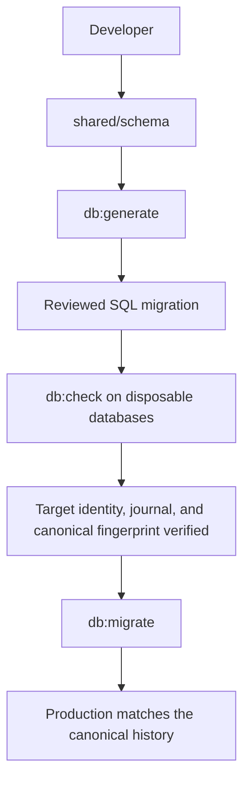

# Database

PostgreSQL is the production database, hosted by Neon. The production
application runs on Render. This document defines the canonical database
state, forward-only migration history, verification model, and production
schema-release workflow after completion of baseline adoption.

## Schema source

The Drizzle schema entrypoint is [`shared/schema.ts`](../shared/schema.ts).
It is a re-export shim for [`shared/schema/index.ts`](../shared/schema/index.ts),
which re-exports the table definitions, relations, enums, and validation
schemas from the individual files under [`shared/schema/`](../shared/schema/).

[`drizzle.config.ts`](../drizzle.config.ts) defines:

- PostgreSQL as the dialect;
- `./shared/schema.ts` as the schema input;
- `./migrations` as Drizzle's output directory; and
- an optional operator-supplied connection for commands that actually connect.
  Generation does not require a database connection.

The runtime Drizzle client is created in [`server/db.ts`](../server/db.ts).
Database invariants that are not represented solely by table declarations are
installed idempotently at application startup by
[`server/db-invariants.ts`](../server/db-invariants.ts). This currently
includes the non-system-admin user organization trigger and the rate-limit
bucket table/index. The checked-in baseline owns the same definitions, and `db:check`
verifies them exactly. Runtime compatibility behavior does not replace a
reviewed schema migration.

The canonical set is
`users_role_org_required_fn()` / `users.users_role_org_required`. Its function body, trigger
timing/events, conditions, arguments, and enabled state in the baseline must
remain identical to the shared compatibility definitions used by startup;
`db:check` compares both paths on PostgreSQL 16 and 17.

The routines under [`server/migrations/`](../server/migrations/) are narrow
startup or data-backfill routines. They are not a replacement for the schema
release process.

## Canonical baseline and source of truth

[`migrations/`](../migrations/) is the only active history. It begins with
`0000_normalized_baseline.sql`. That migration represents the canonical
application schema: it initializes an empty database to the approved 29-table,
307-column schema and installs the three approved invariant functions and
triggers.

The normalized baseline is the canonical schema, and the ordered Drizzle
migrations are the authoritative history of how every database reaches the
current schema. Production must match the canonical structural fingerprint,
and migration history is append-only. These rules give fresh databases,
long-lived databases, reviewers, and deployment tooling one unambiguous state
to compare.

The normal path from a schema declaration to production is:



Each transition is a gate. A review or verification failure stops the release
before the next step; it is not bypassed with manual SQL.

Existing production databases did not execute the baseline SQL. They adopted
`0000_normalized_baseline` by guarded registration of the reviewed migration in
the Drizzle journal only after their existing structure matched the canonical
fingerprint. Baseline SQL is never re-executed against an adopted production
database. The journal entry records that the already-existing schema satisfies
the baseline; it is not permission to rebuild that schema.

The active history grows only by appending new migrations. For example, an
illustrative future history could be:

```text
0000_normalized_baseline
0001_remove_cardpointe
0002_add_stripe_feature
0003_add_tournament_tables
```

Every future schema change, including a correction to a structure introduced
earlier, must be represented by a new migration. Never edit an adopted
migration or regenerate the normalized baseline: doing so would make the same
journal state refer to different SQL and destroy reproducibility.

Active SQL identity is the SHA-256 of the exact committed bytes, not a
line-ending-normalized string. Active and test-fixture migration SQL must be
valid UTF-8 with LF endings. `.gitattributes` enforces those endings across
Windows and Linux, and `npm run db:migration-bytes:check` verifies the
attributes, raw bytes, active metadata, and `migration-checksums.json`. CI runs
the same check in a clean `core.autocrlf=true` clone without ignored or local
artifacts.

### Legacy history

[`migrations-legacy-do-not-replay/`](../migrations-legacy-do-not-replay/) keeps
the old mixed SQL and metadata as evidence only. Its journal selected eight
files, replayed 17 tables, and did not reconstruct the 29-table intended
schema. No active/deployment migrator or Drizzle configuration points at it.
Never generate into, adopt from, or replay that directory except through the
fail-closed `db:inventory:validate-local` evidence-reproduction command below,
which preflights the legacy statements and confines replay to its own
tool-owned disposable database.

## Forward-only migration workflow

For each schema change:

1. Update the Drizzle declarations under [`shared/schema/`](../shared/schema/).
2. Generate one descriptively named migration with `db:generate`.
3. Review the generated SQL, metadata, checksum changes, compatibility, and
   data-loss implications. Generated SQL is a proposal until reviewed.
4. Validate the complete history against disposable databases with `db:check`
   and run the other checks required by the change.
5. Apply the exact checked-in migration sequence with one migration executor,
   then deploy the matching CI-verified application commit.

This sequence keeps the declared schema, migration history, deployed schema,
and application version traceable to the same reviewed commit.

### Migration commands

```bash
# Generate reviewed SQL and metadata; does not connect to PostgreSQL.
npm run db:generate -- --name <lowercase_description>

# Apply checked-in migrations in deterministic journal order.
npm run db:migrate

# Verify exact LF SQL bytes, metadata, and the checksum manifest.
npm run db:migration-bytes:check

# Produce or verify the exact versioned application fingerprint.
npm run db:fingerprint -- --verify

# Replay/adopt/check disposable PostgreSQL 16 and 17 databases.
npm run db:check
```

`db:migrate` validates the journal relation, exact column/primary-key format,
absence of rewrite rules, contiguous row ids, sequence `last_value`/`is_called`
state, every stored hash/timestamp against the checked-in prefix, the checked-in
`migration-checksums.json`, and all active metadata before applying SQL.
`db:generate` accepts exactly one `--name` containing only lowercase letters,
digits, and underscores; it pins the reviewed
`drizzle.config.ts`, and runs with an isolated environment that contains no
database URL or config/output overrides. It therefore cannot generate into the
legacy evidence tree. It refreshes the checksum manifest, so a later SQL or
timestamp edit is visible and `db:check` fails until the reviewed manifest is
deliberately refreshed. A database advisory lock serializes migration
executors. Reruns are no-ops. If the journal is absent or empty while
application-owned public objects already exist, the command refuses to run the
baseline; it never treats an empty journal as proof of schema state. Production
has already completed its one-time adoption. Encountering this state there is
drift or a target error, not a reason to repeat adoption.

Journal validation is physical, not name-only. The only accepted relation is
the ordinary permanent, standalone, nonpartitioned and noninherited heap table
`drizzle.__drizzle_migrations`, with default physical options and no RLS, with
exactly these columns in physical order: `id integer NOT NULL` using the
installed `SERIAL` default, `hash text NOT NULL`, and a nullable
`created_at bigint` column. It requires the sole, validated, non-deferrable
primary key and sole ready/valid B-tree index named
`__drizzle_migrations_pkey` on `id`, no other
constraints, indexes, triggers, policies, or user rewrite rules, and the exact
owned integer
sequence `__drizzle_migrations_id_seq` (start/increment/minimum/cache `1`,
maximum `2147483647`, no cycle, matching owner, one automatic ownership
dependency, and one default dependency). Its rows must use ids `1..N`, and the
sequence must be `1`/not-called when empty or `N`/called for `N` rows. Extra,
dropped, identity, generated, or defaulted columns and alternate or ambiguous
journals are refused.

Use one migration executor per environment and deploy with
expand–migrate–contract sequencing: add backward-compatible structures first,
deploy code that tolerates both states, migrate/backfill data through a
separately reviewed operation, then remove old structures in a later release.
Do not combine destructive contract steps with the expansion that makes them
safe.

Direct schema reconciliation is retained only as `npm run
db:push:disposable`. It accepts only the exact `127.0.0.1` published port of a
running tool-owned Docker container. Immediately before spawning Drizzle it
verifies the full container ID, per-run ownership/purpose labels, exact
approved-database label, database name and role, and database comment marker;
the same immutable URL is used for proof and execution. The child gets only a
minimal operating-system environment, the exact URL, a disabled dotenv input,
and the explicit reviewed config, so inherited Node/Drizzle/PostgreSQL overrides
cannot redirect it. Remote hosts, generic
development allowlists, and `DEV_DB_OK`-style bypasses are not accepted. It is
for throwaway databases created by repository tooling, not durable local
databases, Neon branches, deployment, or migration generation.

## Read-only schema inventory

The repository provides a read-only inventory command:

```bash
npm run db:inventory -- --output .artifacts/db-inventory/example.json
```

The command uses the operator-supplied connection, opens a PostgreSQL
`REPEATABLE READ, READ ONLY` transaction, and fails before writing an output
file unless PostgreSQL confirms both transaction settings. It uses PostgreSQL
catalog queries plus a narrowly scoped read of the approved Drizzle
migration-journal relation. It does not run application startup, `db:push`,
migrations, invariant installation, or data backfills.

Inventory format version 3 records PostgreSQL row-security metadata. For
each table it captures `relrowsecurity`, `relforcerowsecurity`, owner,
connected-role ownership, effective connected-role table privileges, and the
reason that role is governed by or bypasses RLS. It separately records the
normalized ACL, every `pg_policy` name, command, permissive/restrictive mode,
target roles, `USING`, `WITH CHECK`, catalog-visible function/relation
dependencies, and whether the policy applies to the connected role. Reference
signals flag the documented Neon Data API/Auth objects (`auth`, `neon_auth`,
`authenticated`, `anonymous`, and JWT-related expressions) for owner review;
they do not automatically declare application ownership.

PostgreSQL 17 and newer add the `MAINTAIN` table privilege. Inventory format
version 3 records it from ACLs on every supported server and includes it in
the connected role's effective privileges on PostgreSQL 17 and newer. The
effective-privilege query omits that token on PostgreSQL 16 and older, where
asking `has_table_privilege` about `MAINTAIN` is itself an error.

Format version 3 also inventories sequences. For each sequence it records the
schema/name, permanent/unlogged persistence, integer type and numeric settings,
cycle state, owning table and
column, ownership-dependency type, column default linkage, owner, and whether
the connected role can act as that owner. The application fingerprint uses
the 26 sequences automatically owned by approved public-table `id` columns;
provider-managed and unrelated sequences remain outside its scope.

The installed Drizzle PostgreSQL migrator defaults to
`drizzle.__drizzle_migrations`, so that is the approved default. Catalog
discovery reports every non-system relation named `__drizzle_migrations`, but
the command inspects columns and reads rows only from the approved relation. It
refuses ambiguous discovery when multiple matching relations exist. An
independently verified alternate can be selected explicitly with validated,
unquoted identifiers:

```bash
npm run db:inventory -- --journal-relation audit.__drizzle_migrations \
  --output .artifacts/db-inventory/example.json
```

The normalized JSON captures:

- a SHA-256 fingerprint of the connection host and port, without the hostname,
  URL, password, or connection-string credentials;
- current database, role, PostgreSQL version, and confirmed transaction mode;
- connected-role `rolsuper` and `rolbypassrls` state;
- schemas, tables, columns, data types, nullability, defaults, identity and
  generated-column behavior, plus sequence definitions and ownership/default
  linkages;
- table owners, effective and granted table privileges, RLS enforcement mode,
  normalized policy definitions, and policy dependency/reference signals;
- primary, foreign-key, unique, check, and exclusion constraints;
- indexes and PostgreSQL's normalized index definitions;
- enum, domain, range, multirange, composite, and user-schema base types;
- non-extension-owned functions in application schemas;
- non-internal triggers and their function relationships;
- installed extensions; and
- migration-journal discovery metadata, separate column-inspection and
  row-collection status, and the approved journal's `id`, `hash`, and
  `created_at` entries when that relation exists. Exact journal validation also
  covers the table's physical relation properties, absence of user rewrite
  rules, primary-key index details, sequence definition/ownership, contiguous
  row ids, and the sequence's runtime state.

Inventory files contain structural and environment metadata. Treat them as
review artifacts rather than source files. The default generated path,
`.artifacts/db-inventory/`, is ignored by Git.

Compare two inventories with:

```bash
npm run db:inventory:compare -- left.json right.json
npm run db:inventory:compare -- left.json right.json --json --output comparison.json
npm run db:inventory:compare -- left.json right.json --report-only
```

The comparison ignores top-level object ordering and JSON property ordering.
It uses quote-aware whitespace normalization that preserves quoted strings,
quoted identifiers, regular expressions, comments, and dollar-quoted function
bodies. Lexically incomplete or uncertain definitions are retained
byte-for-byte rather than being rewritten.
It reports missing-from-right, extra-in-right, and changed objects separately
for environment metadata, schemas, tables, table privileges, policies,
columns, sequences, constraints, indexes, types, functions, triggers,
extensions, and migration journal state. A normal comparison exits nonzero when differences
exist or input is invalid or incomplete. `--report-only` preserves the report
but exits zero for an expected transitional mismatch.

Run the known local comparison with Docker Desktop available:

```bash
npm run db:inventory:validate-local
```

This command first reads and preflights all eight journal-listed files. The
fail-closed allowlist accepts only the statement shapes present in that chain:
enum type creation, table creation, ordinary or unique index creation, adding
columns, adding foreign-key constraints, and setting a column `NOT NULL`.
Unsupported, data-changing, destructive, privilege, ownership, role, schema,
or database operations are rejected before Docker starts, before the replay
database exists, and before a replay connection opens.

After preflight, the command creates a uniquely named PostgreSQL 16 container
with an invocation ownership label and captures its exact container ID. It
creates one database from current declarations with the guarded disposable
push wrapper and another by transactionally replaying the journal under
`migrations-legacy-do-not-replay/`. It never writes
`__drizzle_migrations`. Every run writes to its own ignored
`.artifacts/db-inventory/<run-id>/` directory. Container actions and cleanup
use the captured ID after ownership-label verification; cleanup failure is a
validation failure. The known 29-versus-17 difference remains the expected
result, not a green schema-equivalence assertion.

Neither local inventory includes the startup functions and triggers from
`server/db-invariants.ts`, because the local comparison deliberately measures
the two schema-deployment mechanisms before application startup. An inventory
of a database where the application has booted will capture those functions
and triggers and report them as structural differences.

Fresh current-schema and current-schema-plus-invariants databases both leave
RLS disabled and define no policies. Do not enable RLS locally merely to make a
provider clone compare cleanly.

### Approved legacy inert RLS state

Production retains one reviewed legacy difference from a fresh baseline: all
application tables have row-level security (RLS) enabled, but no RLS policies
exist and `FORCE ROW LEVEL SECURITY` is not enabled. The application role's
reviewed ownership and bypass behavior make the bare flags inert. This state is
intentional; it does not provide active RLS authorization.

Verification tooling recognizes this exact state as `legacy-inert-rls` and
normalizes only the RLS-enabled flags when comparing production with the
canonical fingerprint. The exception exists for fingerprint comparison only.
It does not change the raw inventory, create policies, weaken any other schema
comparison, or make a mixed RLS state acceptable.

Do not "fix" the difference by disabling RLS in production or copying the bare
enabled flags into source. Either action would create unreviewed drift without
adding a security boundary. If the project intentionally adopts active RLS in
the future, design policies, roles, privileges, tenant-isolation tests, and a
forward migration together. Until then, any policy, forced RLS, mixed table
state, or changed role assumptions must fail verification and receive explicit
security review.

## Organizations subdomain index decision

The active baseline definition is the production-shaped partial index:

```sql
CREATE UNIQUE INDEX organization_subdomain_idx
  ON organizations (subdomain)
  WHERE subdomain IS NOT NULL;
```

PostgreSQL unique indexes treat nulls as distinct unless `NULLS NOT DISTINCT`
is specified, so both the partial definition and the current full source index
allow multiple null subdomains and reject duplicate non-null subdomains. The
application lookup is equality on `organizations.subdomain`; there is no
application `IS NULL` lookup. A PostgreSQL 16 generic prepared-plan probe
confirmed that equality lookup can use the partial index. The partial form
stores and maintains only assigned subdomains, while the full form additionally
stores null entries and could serve a future `IS NULL` lookup or full index
ordering. Those unused capabilities do not justify production index churn or
a larger baseline index. Both `shared/schema` and the normalized baseline
express the approved predicate.

## Disposable Neon branch inventory procedure

Use a disposable Neon branch cloned from production when provider-shaped
inventory evidence is required. This procedure is not approval to inventory or
modify production.

1. Independently identify the project, source branch, disposable target branch,
   endpoint, database, and role. Do not infer target identity solely from a
   connection string.
2. Use a pre-provisioned read-only or least-privilege login where practical.
   Supply connection details and the independently recorded expected identities
   through the approved secret-aware operator environment.
3. Run the inventory command with expected-target verification and write its
   output only to the ignored review-artifact directory.
4. Do not start the application, push a schema, run migrations, install
   invariants, seed data, or run backfills as part of inventory collection.
5. Review the normalized inventory, compare it with the canonical local
   inventory, retain it in the approved artifact system, and remove connection
   material from the operator session.

The inventory tool fails closed when provider hierarchy, endpoint, database,
role, or source-branch evidence is missing or inconsistent. This keeps a
disposable clone from being mistaken for production or for an unrelated branch.


## Exact baseline fingerprint

The installed versions are `drizzle-orm@0.45.2` and
`drizzle-kit@0.31.10`. The PostgreSQL migrator defaults to schema `drizzle`
and table `__drizzle_migrations`; it creates `id SERIAL PRIMARY KEY`,
`hash text NOT NULL`, and nullable `created_at bigint`. It hashes the exact SQL
file bytes with SHA-256, uses the journal entry's `when` value as
`created_at`, reads only the row with the greatest `created_at`, and runs every
migration whose journal timestamp is greater. An existing empty table means
there is no last migration, so it causes every checked-in migration to run; it
is not evidence that a baseline is satisfied. The runner does not reconcile
stored hashes against the checked-in files.

`migrations/baseline-fingerprint.json` is fingerprint format version 2. Older
format versions are refused rather than silently reinterpreted. It contains a
SHA-256 digest plus the exact normalized structural inventory for the 29
application tables, 307 declared columns, 26 owned integer sequences and their
settings/ownership/default linkages, constraints, physical indexes,
`public.user_role`, three functions, three triggers, and zero policies. It
records RLS disabled on every application table. Provider-managed schemas,
roles, extensions, privileges, role-owner identities/capability metadata,
connection metadata, and physical column ordinals are deliberately excluded.
Column names and all other declared properties remain exact, so historical
physical order can differ without weakening adoption checks.

The approved identity is:

- tag: `0000_normalized_baseline`
- exact SQL SHA-256:
  `9f4398b0e90bb5a5e33406cc5f35faf73b9c9dcbff3c781bacc892479c31a302`
- journal `created_at`: `1784104330176`
- structural fingerprint SHA-256:
  `1c3c518e09d155bc3d447399c6c7a41ee4433423ed445b5f4a7554ed7607772a`

`npm run db:fingerprint -- --verify` collects catalog state inside a confirmed
`REPEATABLE READ, READ ONLY` transaction, reads no application rows, fails on
an incomplete inventory, and compares every encoded object rather than only
the digest.

## Baseline adoption history

Legacy production databases predated the normalized baseline. Production
therefore completed a one-time guarded adoption after the baseline and its
fingerprint had been reviewed.

Adoption consisted solely of registering `0000_normalized_baseline` in the
migration journal after exhaustive verification proved that the target
database already had the canonical application schema. The process verified
the provider and database identities, structural fingerprint, journal state,
role capabilities, backup evidence, and the approved legacy inert-RLS
normalization before permitting the atomic journal registration.

No baseline DDL was executed. Production schema, application rows, and
application behavior were intentionally unchanged; only the journal learned
that the existing schema satisfied the baseline. This distinction is why the
baseline must never be re-executed and adoption must never be repeated.

The adoption tooling remains historical safety infrastructure and may be used
for repository-owned disposable verification where documented. It is not part
of the normal production migration workflow and must not be used to re-adopt
production or another durable database.

## Verification before migration

Schema verification is a prerequisite, not a post-migration diagnostic. Before
any migration is permitted, deployment tooling fails closed unless it can
establish all of the following:

1. The provider identity matches the independently reviewed target.
2. The database and role identities match the expected database.
3. The application schema matches the canonical structural fingerprint.
4. The Drizzle journal has the exact valid prefix for the checked-in migration
   history.
5. Where applicable, the database matches the narrowly approved
   `legacy-inert-rls` state after normalizing only those inert flags for the
   fingerprint comparison.

This ordering prevents valid migration SQL from being applied to the wrong
database, on top of unknown drift, or against a misleading journal. Any failed
identity, fingerprint, or journal check stops the release; operators investigate
the mismatch rather than bypassing verification or editing production by hand.

## Production migration process

Follow the schema-release procedure in
[`production-runbook.md`](./production-runbook.md):

1. Start from the exact CI-verified commit that will be deployed. Confirm the
   intended Neon project, branch, host, database, and user independently.
2. Create a current Neon backup or branch suitable for restoration before
   changing the schema.
3. Use only reviewed migrations from that commit. Never substitute generated,
   local, or manually edited SQL during deployment.
4. Run the pre-migration identity, canonical fingerprint, journal, and approved
   legacy inert-RLS checks. Abort before executing SQL if any check differs
   from the reviewed expectation.
5. Run `npm run db:migrate` with one migration executor. Abort for an
   unexpected journal or migration failure and record the result.
6. Deploy the matching CI-verified application commit after the schema change
   is applied successfully.
7. Verify `/api/health`, authentication, the affected workflow, and any
   relevant payment-provider or webhook behavior. Confirm that Render is
   running the expected commit.

For an application-only rollback, redeploy the previous known-good commit. For
a schema regression, stop further deploys and use the prepared Neon restore
plan. Do not guess at a reverse migration.

Production must change only through this reviewed, forward-only workflow.
Manual schema edits and out-of-band production changes make fingerprints and
journal history unreliable, so they are treated as drift rather than shortcuts.

## Backup expectations

- A current Neon backup or restorable branch is required before every
  production schema release, especially before any change that may remove or
  rewrite data.
- The backup must be associated with the verified production project, branch,
  host, and database. A local or test backup is not a production recovery
  plan.
- `npm run db:migrate` does not create a backup. This repository has no package
  script that replaces Neon backup/restore operations.
- Keep the restore plan and the reviewed schema-change output available until
  post-deployment checks pass.
- Organization deletion is an application-level destructive operation, not a
  substitute for a database backup. It is implemented as an atomic,
  system-admin-only teardown in
  [`server/storage/organizations.ts`](../server/storage/organizations.ts).

## Prohibited practices

The following are not permitted as ad-hoc database work:

- pointing local, test, or exploratory commands at the production Neon
  database;
- using any schema-push mechanism as a substitute for reviewed migrations, or
  using `db:push:disposable` against production or a durable shared database;
- editing any previously adopted migration or regenerating
  `0000_normalized_baseline`;
- rerunning baseline adoption against production or another adopted database;
- manually inserting, updating, deleting, resequencing, or otherwise repairing
  migration-journal rows;
- accepting an unexpected destructive statement from Drizzle without an
  explicit reviewed release plan and a restorable backup;
- manually dropping or renaming production tables, columns, constraints, or
  indexes;
- rewriting migration history to disguise a later schema change;
- running destructive SQL, including database or table drops, outside the
  reviewed production procedure; or
- adding startup behavior that silently performs destructive schema changes.

The current tree includes intentionally destructive historical SQL, including
[`migrations-legacy-do-not-replay/0041_remove_youth_guardian_support.sql`](../migrations-legacy-do-not-replay/0041_remove_youth_guardian_support.sql).
Its presence does not make it safe to run blindly; review its statements and
the live database state before any such release.

## Tenant ownership relationships

`organizations` is the tenant root. Organization ownership is represented both
by direct `organization_id` columns and by parent relationships. Foreign keys
ensure that referenced rows exist, but they do not enforce same-organization
relationships for every multi-tenant join. Server-side authorization and the
runtime invariants remain part of the tenant boundary.

| Data | Current ownership relationship |
| --- | --- |
| `locations` | Directly owned by `organizations` through required `organization_id`. Payment-provider credentials are stored on the location row. |
| `leagues` | Direct `organization_id` and optional `location_id`. `organization_id` remains nullable for legacy/orphan cleanup; newly created application rows require an organization, and normal access-control paths reject org-less leagues. |
| `teams`, `games`, `league_registration_questions` | Owned through `league_id`, and therefore through the league's organization. Games own `scores` through `game_id`; scores also reference a bowler and team. |
| `bowlers` | Directly owned by `organizations` through required `organization_id`. `bowler_leagues` connects a bowler to a league and team and must remain within the same tenant. |
| `payments`, `payment_schedules` | Reference both `bowler_id` and `league_id`; tenant access is derived from and checked against those owning rows. |
| `league_registrations` | Direct required `organization_id`, plus `league_id`, `bowler_id`, and optional `payment_id`. The direct organization stamp is checked against the related workflow by the application. |
| `users` | `organization_id` is nullable only for platform `system_admin` accounts. The runtime trigger rejects org-less non-system-admin users. Users may also reference a bowler and location. |
| `bowler_payment_links` | Direct required `organization_id`, plus two bowlers and the creating user. The payment-link routes verify that both bowlers and the caller belong to the same organization. |
| `apple_pay_job_items` | Optional organization and location references identify the tenant work item. The parent `apple_pay_jobs` row is platform operational state and may reference its creator. |
| Tenant audit/recovery rows | Admin password/role audits and orphan-cleanup audits carry direct organization references where applicable. Some audit foreign keys are nullable or `set null` so history can survive cleanup. Email/profile audit rows are scoped through their user references. |

The remaining operational tables are not tenant roots: `session`, email
templates, deletion requests, rate-limit buckets, and alerter state are
platform-wide. Alerter payloads can contain organization or league identifiers,
but the `alerter_state` table itself has no organization foreign key.

Normal tenant access is server-authorized from the authenticated user and
organization context; a client-supplied organization, league, location, team,
bowler, payment, or other identifier is not an ownership proof. Org-less
resource rows are treated as orphaned data and are available only through the
explicit system-admin data-integrity tooling.

Permanent organization deletion is system-admin-only and runs as one database
transaction. It removes application-owned tenant data and related audit rows,
preserves platform system-admin accounts by detaching them, and does not
delete remote Square customer objects.
