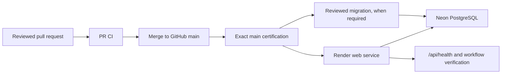

# Production Deployment

This is the authoritative overview and operator checklist for deploying
LeagueVault to production. It explains the release boundaries and the order of
operations. This file is stored under `docs/` as `DEPLOYMENT.md`.
Repository paths are case-sensitive on Linux: the database authority is
uppercase [`DATABASE.md`](DATABASE.md), while the detailed release
runbook is lowercase
[`production-runbook.md`](production-runbook.md).

> **Operational dashboard state last verified:** 2026-07-21
>
> **Authoritative dashboard:** Render production service settings

Production changes only from reviewed, CI-verified GitHub commits. A successful
build, a successful migration, and a healthy process are separate gates; no one
gate proves the others are safe.

## 1. Deployment architecture

LeagueVault has four production control planes:

- **GitHub** is the source of deployable revisions. Protected `main`, pull
  request checks, and Exact main certification identify the commit eligible for
  release.
- **Render** hosts the application and performs the application build, start,
  rollout, log capture, and HTTP health check.
- **Neon** provides the production PostgreSQL database and its backup/recovery
  controls.
- **Drizzle ORM** defines the schema in `shared/schema/`; the append-only files
  in `migrations/` are the only active forward migration history.



Deploy the exact `main` commit certified by GitHub. Do not deploy a local build,
an unreviewed branch, or a different commit that merely appears equivalent.

## 2. Render services

The documented production topology contains one Render service (last verified
in the live dashboard on 2026-07-21):

| Service | Purpose and type | Trigger and scaling | Interactions |
| --- | --- | --- | --- |
| `LeagueVault` | Render **Node Web Service** in the Ohio region, serving the React application and Express API on the Starter plan | Tracks GitHub `main`; Auto-Deploy is `After CI Checks Pass`. Production runs one instance. A schema release uses the runbook's verified [auto-deploy hold and restoration procedure](production-runbook.md#schema-release-auto-deploy-hold) so migration precedes rollout. | Receives all HTTP requests, opens the PostgreSQL connection pool to Neon, serves the built frontend, and starts the in-process payment scheduler, retry sweeps, Apple Pay recovery worker, catalog audit, and provider probes. |

There is no checked-in Render Blueprint and no separately documented production
Render worker or cron service. Render dashboard state is therefore an external
operational control. Before each release, verify that the dashboard still
matches this topology. If an additional production service exists, stop and
update this document before deploying.

The single-instance assumption matters because some startup recovery and
scheduling behavior is process-local. Do not scale the web service horizontally
until payment scheduling, job recovery, leader election or locking, and
duplicate third-party side effects have received focused review and tests.

Ownership is intentionally consolidated today:

- the Render web service owns HTTP requests;
- that same process owns background startup work and recurring schedulers; and
- that same process owns the application database connection pool.

## 3. Build command

The exact Render dashboard build command is:

```bash
npm install --include=dev && npm run build
```

The install includes build-time dependencies. The repository build script then
runs Vite to produce the React client under `dist/public` and esbuild to bundle
`server/index.ts` as the production entry point `dist/index.js`. Render must use
the Node 22.x version declared by the repository and npm with the committed
`package-lock.json`.

Validation belongs primarily in GitHub CI, before Render receives a revision:

1. The active `main` ruleset requires `Type check & lint` and `Tests`.
2. Repository release policy also requires operators to verify `Database
   migrations (PostgreSQL 16)`, `Database migrations (PostgreSQL 17)`, and
   `Race suite`, even while those checks are not ruleset-enforced.
3. Security and privacy checks, including Semgrep, Gitleaks, HoundDog, and
   dependency audits, must be reviewed.
4. After merge, Exact main certification proves PR provenance, verifies the
   exact migration bytes and metadata, and rebuilds the merged SHA.

Render should perform only the deterministic install/build needed to create its
runtime artifact, then start and health-check it. Render is not a substitute for
PR tests, database migration tests, or security review. In particular, a build
does not connect to the intended production database and cannot prove that it is
safe to migrate.

## 4. Start command

The exact Render dashboard start command is:

```bash
npm run start
```

The package script executes `NODE_ENV=production node dist/index.js`. The
production startup sequence is:

1. Parse and validate the runtime environment and fail closed on missing or
   invalid required configuration.
2. Create the Express application, install security/authentication middleware,
   register `/api/health` and application routes, and configure production
   static-file serving.
3. Initialize the PostgreSQL pool and prove connectivity with a bounded retry.
   Startup exits if the database cannot be reached.
4. Install the retained database runtime invariants transactionally. These
   statements are deliberately idempotent so concurrent or repeated boots do
   not accumulate duplicate objects.
5. Run the retained, rerunnable startup maintenance routines for avatars,
   missing payment customers, and default email templates. Their failures are
   logged for investigation.
6. Bind the HTTP listener to Render's port.
7. Initialize the payment scheduler and recurring retry sweeps, then start the
   non-blocking Square/provider probes, Apple Pay recovery, custom-attribute
   bootstrap, and catalog audit.
8. Register graceful shutdown handling.

### Startup failure classes

**Fatal startup gates** prevent the process from becoming a usable production
instance:

- runtime environment validation, including required configuration and
  production safety checks;
- initial PostgreSQL connectivity after bounded retries;
- transactional database-invariant installation; and
- binding the HTTP listener.

A fatal-gate failure terminates or rejects startup. Render should keep the
instance out of service, and the operator must investigate instead of weakening
the gate.

**Nonfatal startup tasks** log their failures and allow the HTTP process to
continue:

- avatar storage/URL maintenance;
- missing payment-customer backfill;
- default email-template seeding;
- payment-scheduler and retry-sweep initialization; and
- provider-version/pin probes, Square custom-attribute bootstrap, Apple Pay
  recovery, and the Square catalog audit.

These tasks are nonfatal at the process boundary, not operationally optional. A
failed task can leave its feature degraded while `/api/health` remains healthy,
because that endpoint checks HTTP responsiveness and database connectivity, not
maintenance, scheduler, worker, or provider progress. Treat the corresponding
boot-log error as an incomplete deployment until the affected workflow is
verified or recovered.

Runtime invariant installation and startup maintenance exist for compatibility
and recovery. They do not inspect, approve, or apply the Drizzle migration
history and never replace `npm run db:migrate`. Adding startup DDL as a shortcut
around a reviewed migration is prohibited.

## 5. Health checks

The production Render Web Service is configured with the following Health Check
Path:

```text
/api/health
```

Render uses this endpoint during deployment rollouts and normal service
monitoring. A healthy request returns HTTP 200 and JSON containing
`status: "healthy"` plus a current timestamp.

The endpoint executes a database connection probe, so a successful response
confirms that:

- the Express process can receive and serve HTTP requests; and
- the PostgreSQL connection pool can successfully execute a simple query.

A database probe failure returns HTTP 503 with `status: "unhealthy"`.

The endpoint intentionally does **not** prove:

- that Render is running the intended Git commit;
- that every migration, invariant, or data backfill has the intended result;
- that authentication, tenant isolation, or a changed business workflow works;
- that schedulers and background workers are making progress; or
- that Square, SendGrid, Sentry, or webhooks are configured and
  operational.

Deployment success therefore requires the Render rollout and health check,
commit verification, log review, authentication, affected workflows, and
relevant integration checks. The health endpoint is one deployment gate, not
proof that the deployment is complete.

## 6. Environment-variable ownership

Environment variables cross several ownership boundaries:

| Owner | Responsibility |
| --- | --- |
| Render | Stores and injects production application configuration and secrets into the web service; supplies runtime service metadata such as the listening port. Values are literal environment variables, not secret files. |
| Neon | Owns the production PostgreSQL project, branch, endpoint, database roles, connection credentials, and backup/recovery capabilities. Render receives only the approved application connection value. |
| Operators | Verify the intended Render service and Neon target, provision or rotate provider credentials, authorize migrations, and supply short-lived deployment or recovery inputs through an approved secure channel. |
| Repository | Defines variable names, validation rules, safe defaults, runtime ownership, and placeholder-only examples. It never owns production values. |

The production runtime requires the environment classification, domain,
database connection, session signing, and field-encryption configuration
documented in [`production-runbook.md`](production-runbook.md#render-configuration).
Optional integrations and provider credentials are configured only when their
features are enabled.

Never commit secrets or production values. Never copy production values into a
development, test, beta, screenshot, log, fixture, or prompt. Migration target
proofs, confirmation tokens, probe credentials, and other temporary deployment
variables are ephemeral: scope them to the one approved operation, do not echo
them, and unset them immediately afterward. Production payment credentials are
location- and environment-specific and are not interchangeable.

## 7. Production deployment sequence

Classify the release before merge because the classification determines whether
Render must be held and which recovery evidence is required:

| Release type | Production migration | Render auto-deploy | Backup and recovery requirement |
| --- | --- | --- | --- |
| Code-only | No | May remain `After CI Checks Pass` | Follow normal operational backup policy; no migration-specific backup is introduced by the release. |
| Expand migration | Yes; apply the reviewed forward migration before application rollout | Temporarily switch to manual | Current Neon backup or restorable branch and approved recovery plan required. |
| Data migration or backfill | Yes, often as a separately reviewed, restartable operation | Manual coordination for every application/data compatibility boundary | Current Neon backup or restorable branch and a data-recovery/restart plan required. |
| Contract or destructive migration | Yes; only in a later release after compatibility is proven | Manual coordination; never allow an automatic schema-dependent rollout | Current Neon backup plus a mandatory, reviewed restore plan that accounts for writes after the backup. |

When a release combines categories, use the strictest applicable controls. Do
not classify a schema or data change as code-only because its SQL runs from a
separate operator command.

Use this order for every release:

1. Determine whether the reviewed release contains a schema migration. For a
   schema release, switch Render Auto-Deploy from `After CI Checks Pass` to
   `Off` before merge using the runbook's
   [verified hold procedure](production-runbook.md#schema-release-auto-deploy-hold)
   so the application cannot outrun its schema. A code-only release keeps the
   normal auto-deploy setting.
2. Merge the reviewed pull request into `main`; never push a normal release
   directly to `main`.
3. Confirm the PR's ruleset-required checks and the manually release-blocking
   migration/race checks succeeded. Review relevant security results.
4. Wait for Exact main certification on the merged SHA and record that exact
   deployable commit.
5. Verify the target Render web service and its deployment trigger. Prevent an
   uncertified newer commit from being selected.
6. For a code-only release, skip to step 10 and verify that Auto-Deploy selects
   the exact certified commit. For a schema release, continue below.
7. Independently verify the intended Neon project, branch, endpoint, database,
   and role.
8. Confirm a current Neon backup or restorable branch and an approved recovery
   plan are available.
9. From the exact certified revision, run the reviewed migration once with the
   guarded procedure in [`DATABASE.md`](DATABASE.md#production-migration-process).
   Stop on any identity, fingerprint, journal, checksum, or SQL failure.
10. For a schema release, manually deploy the matching certified application
    revision. For a code-only release, verify Render's `After CI Checks Pass`
    auto-deploy selected that revision.
11. Wait for the rollout, call `/api/health` explicitly, and verify the running
    commit using the two-source procedure in
    [Running commit verification](#running-commit-verification).
12. Verify authentication, database-backed reads/writes, the affected critical
    workflow, and relevant payment-provider or webhook behavior.
13. Verify scheduler/background-job behavior and inspect Render and Sentry logs
    for new errors.
14. For a schema release, restore `After CI Checks Pass` only after verification
    and confirm the persisted setting as specified by the runbook. If the
    release stops or fails, leave Auto-Deploy `Off` and record the active hold.
15. Declare the deployment complete only after all applicable checks pass.

Migrating before the matching application rollout prevents new code from
starting against a schema it cannot use. Backward-compatible, forward-only
migrations let the old process continue serving during the interval between
migration and rollout. Deploying the identical certified revision keeps code,
schema expectations, and reviewed migration bytes traceable to one source.

## 8. Migration sequence

[`DATABASE.md`](DATABASE.md) is authoritative for schema state and
operator safeguards. The essential release rules are:

- `migrations/` is forward-only and append-only;
- the active history begins at `0000_normalized_baseline`;
- production has completed baseline adoption;
- baseline adoption must never be repeated, and the baseline SQL must never be
  replayed against production; and
- each future schema change appends a reviewed migration applied by exactly one
  executor with `npm run db:migrate`.

Use **expand → migrate → contract** across compatible releases:

1. **Expand:** add backward-compatible tables, columns, constraints, or code
   paths that both the old and new application can tolerate.
2. **Migrate:** apply the reviewed schema change and perform any separately
   reviewed, restartable data transition while both application versions remain
   compatible.
3. **Contract:** remove obsolete structures only in a later release after use
   has stopped and restoration/data-loss implications have been reviewed.

Render may briefly run old and new processes during a rollout. The database
schema must therefore be compatible with both versions. A destructive schema
change coupled to an immediate code assumption can turn a normal rollout or
application rollback into an outage.

## 9. Rollback procedure

### Application rollback

1. Stop further rollout or release activity.
2. Select the previous known-good, CI-verified GitHub revision that is compatible
   with the current database schema.
3. Redeploy that revision through Render without changing the database.
4. Re-run health, commit, authentication, affected-workflow, provider, worker,
   and log verification.

Application rollback leaves forward migrations in place. This is why expand
migrations must remain compatible with the previous application revision.

### Schema recovery

1. Stop the deployment and all further schema changes.
2. Preserve migration output, application logs, the failing revision, and target
   identity evidence without exposing credentials.
3. Do not invent a reverse migration, edit the Drizzle journal, replay the
   baseline, or run manual repair SQL.
4. Use the approved Neon recovery procedure and the backup/restore plan prepared
   before migration.
5. Re-verify database identity, schema, journal, application compatibility, and
   critical workflows before allowing another release.

A database restore is an operational recovery event, not a routine deployment
step. It can discard or fork production writes and requires explicit review and
coordination. See
[`DATABASE.md`](DATABASE.md#backup-expectations) for the recovery
boundary.

## 10. Deployment verification

### Running commit verification

Use the Exact-main-certified full Git SHA as the expected release identifier.
Verify it with both of the repository's available signals:

1. In Render, open the production `LeagueVault` deployment event or deployment
   details. Confirm its deployed commit SHA is the exact certified `main` SHA,
   not merely a branch name, commit message, or deployment timestamp. This is
   the primary deployment-record evidence.
2. Request `GET https://leaguevault.app/api/org-context`. Confirm the JSON has
   `appEnv: "prod"` and that `commit` equals the leading short form of the
   certified SHA shown by Render. This is the independent application-runtime
   cross-check. The value comes from the repository-defined build information
   helper used by the running process.
3. If the application reports `commit: "unknown"`, a different SHA, or a
   non-production `appEnv`, do not declare the rollout complete. Preserve the
   Render deployment metadata and boot logs, then investigate the artifact or
   runtime environment.

The startup log's `Runtime envelope` entry also records the short commit and may
support an investigation, but logs alone are not the primary proof. Sentry is
not currently initialized with a release identifier, so a Sentry event or
timestamp must not be used to establish the deployed commit.

After rollout, verify all applicable items:

- [ ] Render's deployment record contains the exact certified full SHA, and
      `/api/org-context` independently reports `appEnv: "prod"` plus the
      matching short SHA.
- [ ] Render reports the service healthy using the configured `/api/health`
      path, and an explicit request returns HTTP 200 with
      `status: "healthy"`.
- [ ] Render boot/runtime logs and Sentry show no new task-related errors.
- [ ] Authentication, session behavior, and organization/subdomain access work.
- [ ] A representative database-backed read and write succeed with correct
      tenant scoping.
- [ ] Square configuration, charges, refunds, and webhooks affected
      by the release work as expected; no live charge is created merely as a
      generic smoke test.
- [ ] Relevant SendGrid and other enabled integrations behave normally.
- [ ] Payment schedules, retry sweeps, Apple Pay recovery, catalog audits, and
      other affected background jobs show expected progress without duplicates.
- [ ] Scheduler timing uses the configured business time zone and does not show
      an unexpected backlog or repeated execution.
- [ ] The changed workflow and one adjacent critical workflow complete normally.
- [ ] The post-deploy trust-proxy probe is run when proxy, cookie,
      authentication, or rate-limit behavior changed.

A deployment is complete only when the expected revision is running and every
applicable check passes. An unexplained warning, stuck job, provider failure, or
schema mismatch keeps the deployment open.

## 11. Failure handling

Use fail-closed handling for every failure:

| Failure | Response |
| --- | --- |
| Migration fails | Stop. Do not deploy code that requires the change. Preserve output, verify the exact target/journal/current schema, and use the prepared Neon recovery plan if the migration partially committed or changed data. Never edit the journal or bypass validation. |
| Application startup fails | Stop the rollout, inspect Render boot logs and environment validation, and redeploy the previous compatible verified revision if needed. Do not weaken startup checks. |
| Health check fails | Treat the instance as unavailable. Inspect startup, routing, and Neon connectivity; do not change the path or broaden success criteria to force a green rollout. |
| Partial rollout | Prevent further releases, determine which revision each instance is running, and verify schema compatibility. Complete or roll back to one known state; do not leave mixed unknown revisions. |
| Configuration mistake | Correct the value in its owning system through approved operator access, trigger a controlled redeploy, and repeat full verification. Do not commit a production value as a workaround. |
| Environment-variable mistake | Stop, rotate the value if it may have been exposed, restore the approved value in Render or the relevant provider, and verify dependent workflows. Never copy a value from development or guess. |

Safeguards are evidence that the system cannot establish a safe release state.
The response is to stop and investigate, never to disable the check, substitute
manual SQL, or continue because another signal happens to be green.

## 12. Operational philosophy

LeagueVault deployments use reviewed changes, deterministic artifacts, one
GitHub source of truth, forward-only schema evolution, independently verified
targets, reproducible commands, and fail-closed decisions. These principles
exist because tenant data and payment behavior make ambiguity expensive: the
wrong commit, database, credential, or migration can produce an outage,
cross-tenant exposure, duplicate payment work, or unrecoverable data loss.

Prefer a stopped deployment with preserved evidence over a guessed recovery.
Releases should be repeatable enough that a future maintainer can prove what ran,
where it ran, and why it was safe.
